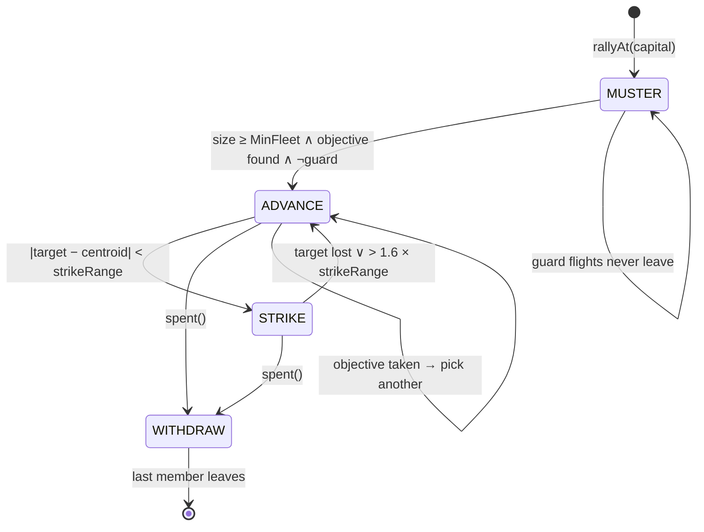
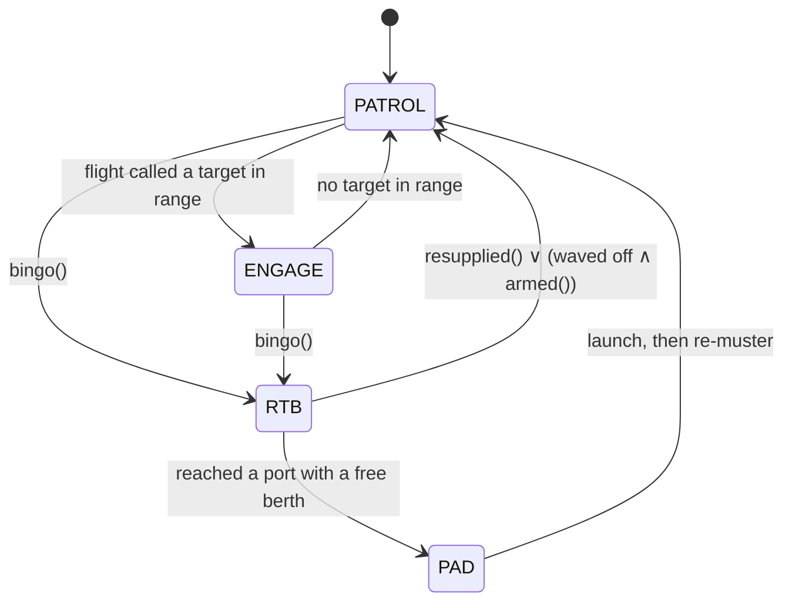

# The Fleet State Machine

**Ships fly together.** A pilot coming off the pad does not set out alone: it
holds over its colour's capital, defends it, and waits for enough company to
make a flight. When the flight is strong enough it picks an objective, forms up
behind a commander, and goes hunting whatever is flying the corridor between
home and the enemy's holding. Attrited or dry, it turns for home and dissolves.

That cycle — **muster → advance → strike → withdraw** — *is* the rotation
between defence and offence. The rotation belongs to the flight, not to the
pilot. An individual pilot only ever does what its flight is doing, plus the
two things that are always its own business: going home when it is dry, and
shooting whatever is about to kill it.

There are two machines here and they run at different rates:

| | Machine | Ticks | Cost |
| --- | --- | --- | --- |
| **Flight** | `ai.Fleet.phase` | every `fleetTick` (0.40 s), **commander only** | one target scan per flight |
| **Pilot** | `ai.Doctrine.st` | every frame | no scans — it reads the flight's call |

That split is the whole efficiency argument. Seventy-two ships each scanning
every entity for a target, every frame, is 72 × N × 60 per second. Twenty
flights scanning once per 0.4 s each is 20 × N × 2.5 — roughly **a thousand
times less work**, and it buys better behaviour rather than worse, because a
flight that shares one called target concentrates its fire instead of
scattering across the nearest dozen contacts.

---

## 1. The flight machine



### Transition table

| From | To | Condition | What it means |
| --- | --- | --- | --- |
| — | `MUSTER` | a pilot asks `rallyAt` and no flight is forming | A flight is raised at the capital |
| `MUSTER` | `ADVANCE` | `size ≥ MinFleet` **∧** an enemy holding exists **∧** not a watch | Enough company: set out |
| `MUSTER` | `MUSTER` | `Guard` is set | A watch is a standing flight; it never leaves |
| `ADVANCE` | `STRIKE` | called target within `strikeRange` of the centroid | Contact — weapons free |
| `ADVANCE` | `ADVANCE` | objective gone or turned friendly | Re-target and press on |
| `ADVANCE` | `WITHDRAW` | `spent()` | Too few, too long, or too dry |
| `STRIKE` | `ADVANCE` | target dead, docked, or beyond `1.6 × strikeRange` | Break off, resume the push |
| `STRIKE` | `WITHDRAW` | `spent()` | Same three reasons |
| `WITHDRAW` | *(gone)* | every member has left | The flight dissolves; the next pilot raises a new one |

`spent()` is the flight's own condition for ending a sortie, and it is three
separate things:

```go
len(members) < MinFleet          // no longer a flight
sortieT > sortieMax              // out too long, on principle
avg(RoundsFrac) < 0.25           // the flight as a whole is dry
```

### What the flight computes, and when

Only in `think()`, only on the commander's tick:

- **`Target`** — one scan over ships. Scored by distance to the flight's
  centroid, minus `corridorBonus` for sitting on the segment between home and
  the objective (the patrol line a strike is meant to break), minus a smaller
  bonus for being the quarry colour.
- **`Objective`** — one scan over planets. Nearest enemy holding, heavily
  penalised if it is not the quarry colour.
- **`prune()`** — drops members that have docked or strayed past `strayRange`,
  and promotes the next pilot if the commander was among them.

While `MUSTER`ing, `Target` is instead the nearest threat within `2 ×
musterRadius` of the port — the flight is the capital's air defence while it
waits, which is what makes forming up a *job* rather than idling.

---

## 2. The pilot machine

A pilot's own state is small, because most of what it does is relay.



| From | To | Condition |
| --- | --- | --- |
| `PATROL`/`ENGAGE` | `RTB` | `RoundsFrac ≤ Bingo` ∨ `Health ≤ HullBingo` ∨ `BattFrac < 0.12` |
| `RTB` | `PATROL` | `resupplied()`: rounds > 2×Bingo ∧ hull > HullBingo+15 ∧ batt > 0.50 |
| `RTB` | `PATROL` | waved off: `rtbT > rtbPatience` ∧ `armed()` — every berth full, or the port is unreachable |
| `RTB` | `PAD` | within `CollisionRange` of a friendly port with a berth free |
| `PAD` | `PATROL` | the turnaround finished and the climb completed |

**Entering `RTB` and entering `PAD` both leave the flight.** A pilot going home
is not in the fight, and this is also how command passes: the commander turning
for home promotes its wingman on the way out. A pilot that dies leaves too —
`Ship.Deaths` changing means this is a new hull, and a new hull is a new pilot
as far as the flight is concerned.

### What the pilot does in each flight phase

| Flight phase | Pilot behaviour |
| --- | --- |
| `MUSTER` | Hold station within `musterRadius` of the port. Break to fight the called threat if it comes within `1.5 × Aggro` — this is the defensive half of the rotation. |
| `ADVANCE` | Fly the formation slot. Take the called target if it comes inside `Aggro`. The **commander** instead flies the flight at the objective. |
| `STRIKE` | Work the called target: close to `Standoff`, fire inside `Aggro`. |
| `WITHDRAW` | Go to `RTB` and leave the flight. |
| *(no flight)* | Fight alone, picking its own target — the fallback when a colour has no port left to muster at. |

### The formation

Wingman *i* stations itself in a V behind the commander, alternating sides and
stepping back a rank at a time:

```
rank  = (i+1)/2
side  = −1 for odd i, +1 for even
slot  = commander.P  −  forward·(rank · formSpacing)
                      +  right·(side · rank · formSpacing · 0.8)
```

The slot is in the commander's frame, so the whole formation turns with it. A
wingman inside `formSlack` of its slot stops chasing and coasts, which is what
keeps the V from oscillating.

---

## 3. Per-pilot variation

Every pilot draws its own tunings from the world's RNG when its doctrine is
created, so a squadron reads as two dozen fliers rather than one program run
two dozen times:

| Tuning | Centre | Spread | What it changes |
| --- | --- | --- | --- |
| `Aggro` | 1024 | ±30% | the range it opens fire at |
| `Standoff` | 512 | ±35% | how close it wants to fight — short is a charger, long is a sniper |
| `Bingo` | 0.15 | ±60% | how empty the magazine gets before it turns for home |
| `HullBingo` | 18–43 | — | how much damage it will take first |
| `Leash` (guards) | 2600 | ±35% | how far it will be drawn off its station |

---

## 4. The knobs

All of it is these numbers, in one block at the top of `internal/ai/fleet.go`:

| Knob | Default | Meaning |
| --- | --- | --- |
| `MinFleet` | 3 | company a pilot waits for before setting out |
| `MaxFleet` | 32 | cap on a flight; the next joiner raises a new one |
| `fleetTick` | 0.40 s | how often a commander re-thinks |
| `musterRadius` | 1400 | how close to the port a forming flight stays |
| `formSpacing` | 260 | gap between wingmen in the V |
| `formSlack` | 180 | how near its slot a wingman must be to stop chasing |
| `strikeRange` | 1800 | where an advance becomes a strike |
| `strayRange` | 6000 | where a member has lost the flight |
| `sortieMax` | 240 s | how long a flight stays out regardless |
| `corridorBonus` | 2500 | preference for targets on the patrol line |

---

## 5. Two things that will bite

**Rally at the capital, never at the nearest port.** Rallying near-est splits a
colour across every rock it holds: a dozen flights of two, none of which ever
reaches `MinFleet`, and the entire squadron sits at home mustering forever.
Measured, before the fix: 45 flights across 72 ships, almost all stuck in
`MUSTER`, and combat stopped entirely. After: ~20 flights, strikes departing at
3–5 ships, a third of the fleet engaged at any moment.

**A watch and a strike flight need separate muster slots.** They form at the
same port and they are different jobs, so a single rally pointer has them
displacing each other on alternate ticks. `rally{strike, watch}` is why the
planet's slot holds a pair.
