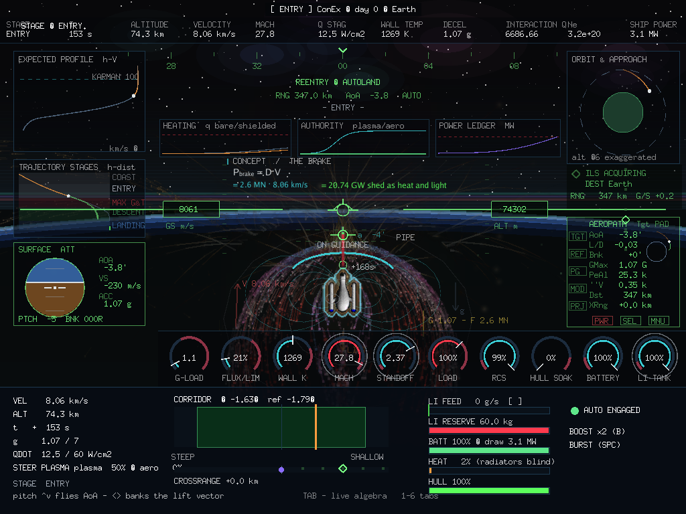
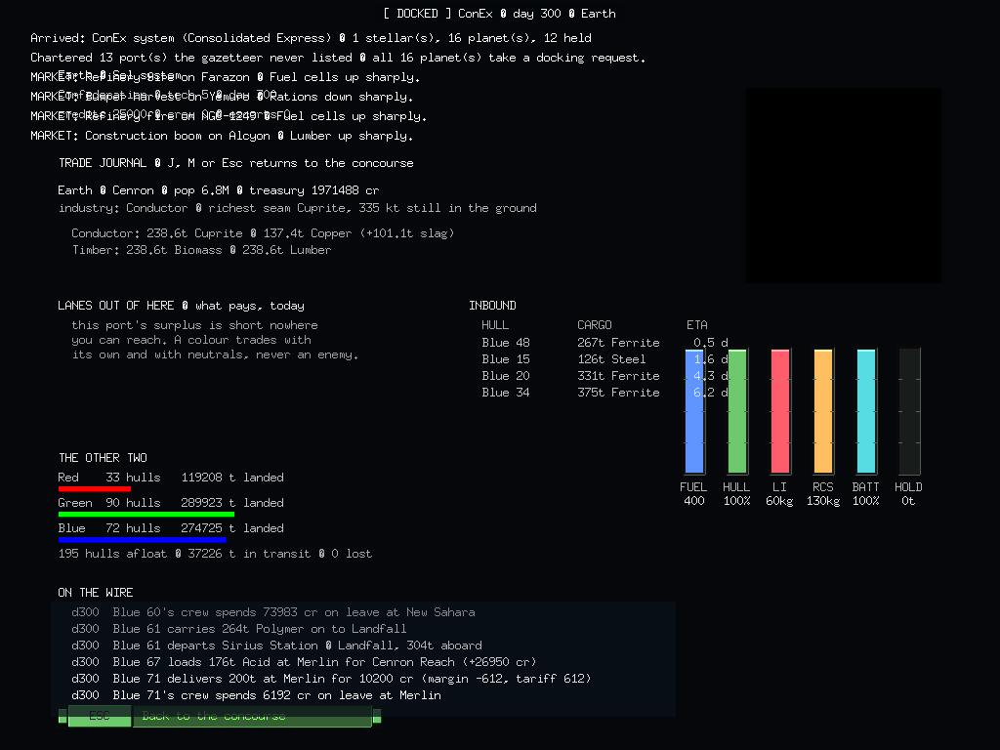

# Gonex — the game as it stands

**[→ Open the full illustrated page (`index.html`)](index.html)** · captured
22 September 2026, seed `20260922`

Every screen you can reach, photographed from the running build; the zero-sum
economy behind them, drawn as flow charts; the reentry physics explained; and
an honest list of what has no art yet.

| | |
|---|---|
|  |  |
| **The reentry corridor** — MHD plasma aeroshell, GPIS instrument cluster, corridor gauge | **The trade journal** — lanes out, inbound ETAs, standings, and the wire |

## Contents of the page

1. One law, two ledgers — mass and credits, both audited
2. The menus · 3. Flight, war and the map
4. The voyage — warp, deorbit, **reentry**, takeoff
5. The concourse and its six screens — bar, missions, commodity board, outfitter, shipyard, journal
6. The Governor's Desk — four tabs
7. **The zero-sum economy** — 30 materials, mass flow, industry by composition, the lithium cycle, hostile worlds, prices, the trade loop, five kinds of agent
8. **Reentry physics** — the magnetopause and the confinement ladder
9. Ship reactors · 10. Measured state · 11. Developer screens
12. **What needs art** · 13. The lab reports · 14. What comes next

## Derived from

- [Game mechanics overview](../lab-reports/2026-09-22-game-mechanics-overview.md) — every mechanic and the test that proves it
- [The lithium fuel cycle](../lab-reports/2026-09-22-lithium-fuel-cycle.md) — the build and its measurements
- [The transmutation core](../lab-reports/2026-09-22-transmutation-core.md) — design only
- [Resource cycle](../resource-cycle-plan.md) · [Trade economy](../trade-economy-plan.md) · [War economy](../war-economy-plan.md)

---

## Art inventory

### What exists

| Asset | Count | Source |
|---|---:|---|
| Ship sprite banks (rotations, target, yard, comm) | 22 | konex + 9 recovered 1997 banks |
| Planet discs | 18 | konex |
| Explosion frames | 17 | konex |
| Pickup items (`health`, `money`) | 2 | konex |
| Landing views (CustPic) | 13 | recovered 1997 |
| Metropolis, plasma, shock, field lines, gauges | — | procedural, per seed |

**Nothing added in the last two passes has a sprite.**

### Needed

**Commodity icons (8)** — legible at 16 px in a list, 32 px on the board.
`Lumber` `Ore` `Rations` `Medicine` `Chips` `Fuel cells` **`Pellets`** **`Melt`**

> The two fuels are the important pair. The entire reactor decision hangs on
> telling them apart at a glance, so they must differ in **silhouette**, not
> just colour — a clad cylinder versus a flask of liquid. `Fuel cells` (the old
> fuel) must not be confusable with either.

**Deeper material icons (22)** — schematic 12 px glyphs beside numbers.
`Steel` `Copper` `Silicon` `Polymer` `Grain` `Lithex` `Lithium` `Heavylith`
`Acid` `Fluid` `Hull` `Rounds` `Missiles` `Compost` `Scrap` `Ferrite` `Cuprite`
`Silicate` `Volatiles` `Biomass` `Spodumene` `Slag`

> `Spodumene → Lithex → Lithium → Heavylith` is one chain and wants one visual
> language — the same silhouette escalating in glow.

**Outfit icons (12)** — the two ladders should *read* as ladders.

| Group | Items |
|---|---|
| Power grid | Auxiliary generator · Deep battery bank · Capacitor array · Radiator wing · Thermal mass sink |
| Reactor ladder | Thermal pile (stock) · Sodium fast loop · Shipboard breeder |
| Confinement ladder | HTS coil rewind · Multipole cusp ring · Phased steering array · Seed injection ring · Cryoplant uprate |

**Building icons (8)** — with level 1–3 indicators and a "genesis / not bought" state.
`Spaceport` `Works` `Habitat` `Exchange` `Lane` `Bastion` `Picket` `Silo`

**Agent markers (5)** — `Courier` `Convoy` `Flight` `Harvester` `Survey`.
Harvester and Survey are new concepts nobody has seen and most need explaining
visually.

**New body types — no art of any kind exists**

| Body | Needs | Role |
|---|---|---|
| **Space station** | orbital silhouette, approach view, landed concourse that is plainly not a planet | pure **sink** — population, no crust |
| **Nebula / asteroid field** | particle field at flight scale, ice-crystal cavern interior | pure **source** — crust, no population |
| **Hostile-world overlay** | dose indicator on the disc and the chart | 14–22 % of worlds are refineries and should look it |

**Animations** — stand-ins are fine; these currently have no visual at all.
Hyperjump entry/exit · harvester working a seam · scoop · refinery plume ·
commission / lay-up · transmutation core *(design only)*

### Known visual bugs

1. **Notification overprint** — the `MARKET:` lines at the top of every docked
   screen draw on top of each other. Visible in nearly every screenshot here.
   Needs a stacked queue with expiry.
2. **Outfitter runs under the gauges** — the new reactor/confinement rows have
   longer descriptions than the original five and now pass beneath the
   fuel/hull/LI cluster.
3. **Chart label collision** — system names in the dense core of the CHART tab
   overlap into illegibility.
