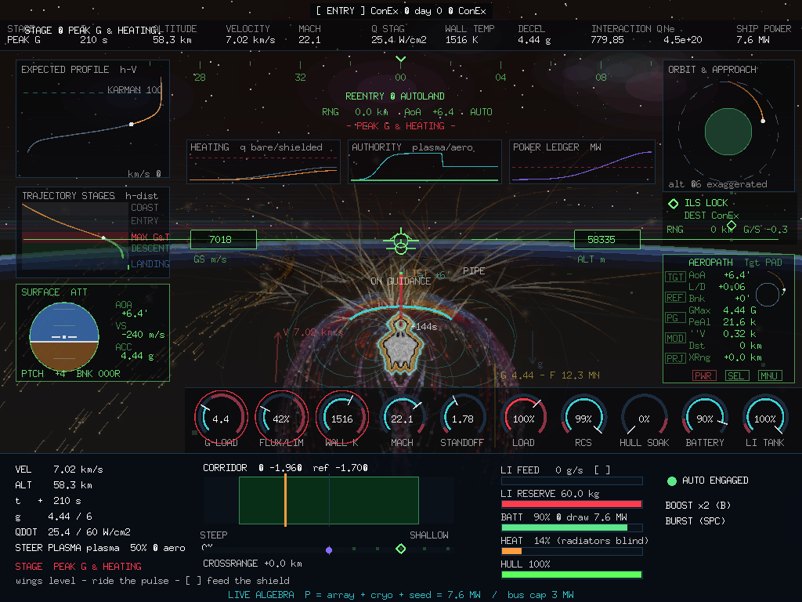
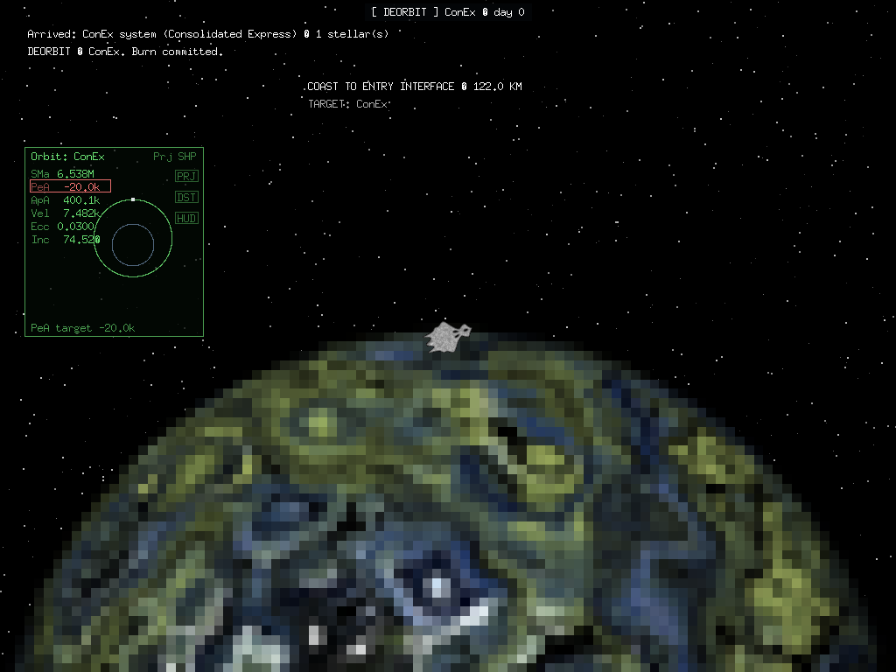
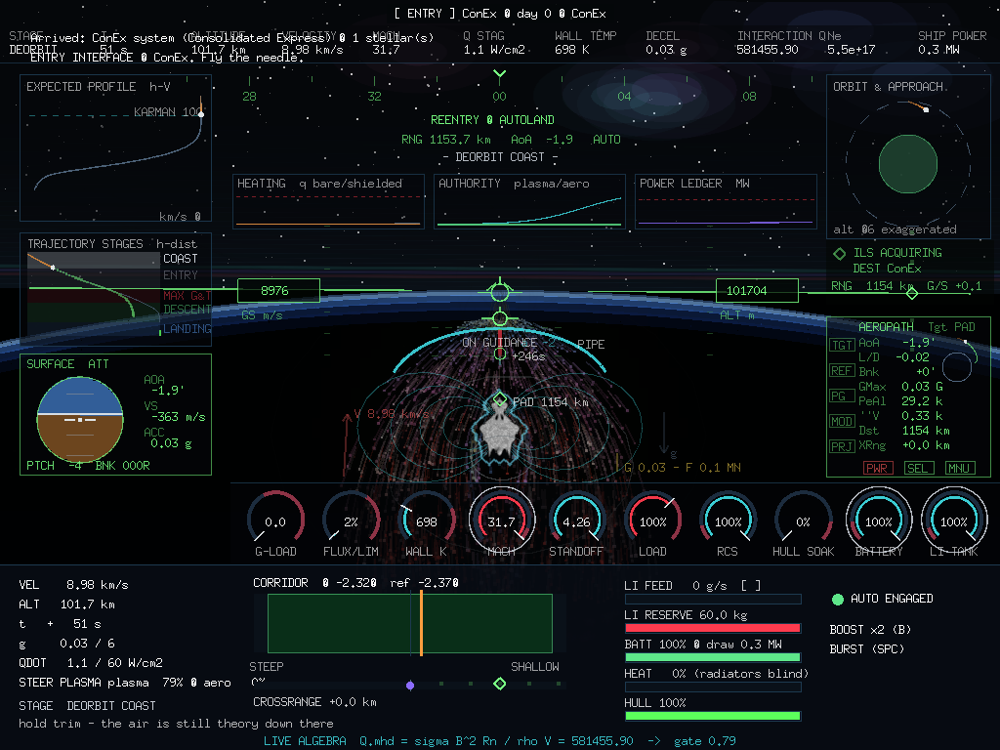
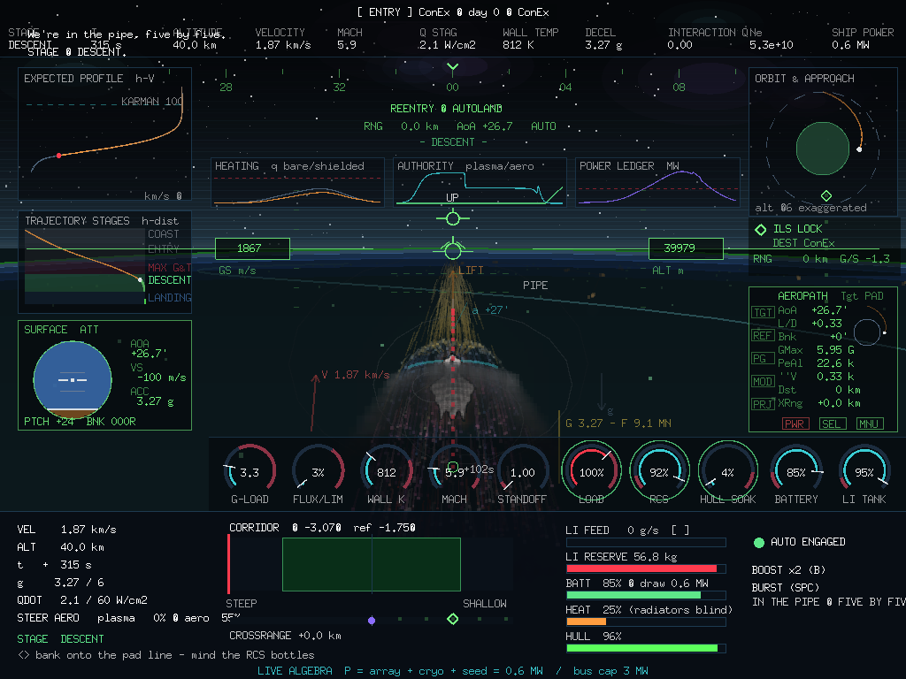
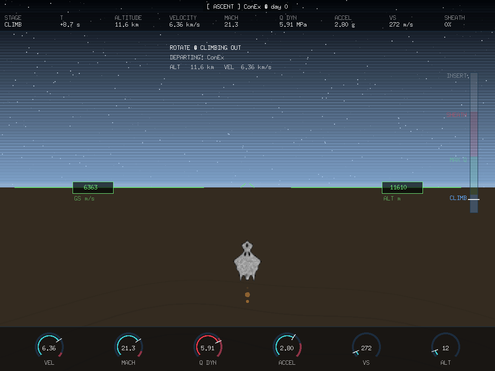

# LR-2026-05 — Six Stages on Instruments: the GPIS Trajectory Taxonomy in the Cockpit

**Date:** 2026-09-01 · **Scope:** `gonex/internal/app` (gpis, entrymode,
deorbit, ilsfinal, takeoffmode) · **References:** *Go Play In Space* ch. 6
"Reentry" (Paton, 3rd ed.), the vendored MHD console
(`vendor/docs/reentry-console.html`), the konex HUD survey
(`vendor/konex/src/interface.cpp`, `target.cpp`, `map.cpp`).

The GPIS reentry chapter teaches the descent as six distinct stages —
deorbit, entry, peak g, skip, descent, landing — each with its own
hazards and its own numbers to watch. This round folds that taxonomy into
the gonex cockpit: the stage is *classified off the live physics every
frame*, and everything downstream — which dials are ringed, which band of
the profile chart is lit, what the control hint says — follows from that
classification. Nothing is scripted to the clock.

## 1. The stage machine (`gpis.go`)

`classifyStage` reads the sim once per frame:

| Stage | Condition (checked in order) |
| --- | --- |
| LANDING | h < 20 km, or V < 700 m/s |
| DESCENT | h < 42 km, or V < 2.4 km/s |
| DEORBIT COAST | h > 100 km — above the Kármán line the air is theory |
| SKIP | γ flat-or-climbing while hypersonic above 55 km |
| PEAK G & HEATING | g > 0.35·G-limit, or q̇ > 0.45·TPS limit |
| ENTRY | otherwise |

The ordering is the design: terminal stages own their altitudes outright,
the skip is a *geometry* condition, peak g is a *loads* condition. A
0.4 s hold keeps the label from flickering on a boundary, and each
transition is a console callout ("STAGE — PEAK G & HEATING.").

Every stage carries a band color (GPIS Figure 3's grey/red/green/blue),
a one-line control hint printed on the panel, and a priority list of
three dial labels. The priority dials get a pulsing ring in the stage
color — the panel itself tells you where to look: MACH/STANDOFF/LI TANK
on entry, G-LOAD/FLUX/WALL-K through the pulse, LOAD/RCS/HULL in the
descent.

## 2. Figure 3, live: the trajectory-stages chart

GPIS Figure 3 plots altitude against distance with the stage bands
painted behind three reference vehicles. The TRAJECTORY STAGES card is
that figure running: the colored altitude bands (COAST 100+, ENTRY
70–100, MAX G&T 50–70, DESCENT 20–50, LANDING 0–20 km), the expected
profile (this seed's autoland, flown headless at interface) as the dim
reference line, the flown trace burning over it in ember orange, and
`Sim.Predict`'s dots running ahead to the pad tick. The band containing
the ship breathes; one glance answers "which chapter of the flight is
this, and does my future stay in the right bands."

## 3. The trainer's MFD grammar

Two green wireframe cards borrow the classic trainer's instrument
language directly:

**SURFACE ATT** — the attitude director: the two-tone ball (sky blue
over ground brown, drawn as rotated chords), rolled with the visual bank,
the horizon riding pitch. PTCH here is the attitude the airframe actually
holds — flight-path angle *plus* trim AoA — which is the chapter's core
lesson made visible: a ship descending at γ = −2° flies nose-high at
+30° trim, and the ball shows exactly that split. AOA/VS/ACC read beside
it; PTCH/BNK on the footer.

**AEROPATH** — the aerobrake computer: AoA, L/D, Bnk, G-Max, and *Pe
Alt* — the predicted low point of the path the current stick position
buys, straight from the live predictor — beside a little planet with the
flown arc and the predicted trajectory bent around it. The button rails
(TGT/REF/PG/MOD/PRJ, PWR/SEL/MNU with the red PWR) are decoration, but
they are the *right* decoration: the family resemblance is the point.

**The deorbit Orbit MFD** — the chapter's one-number ritual: "PeA should
read −20 km after the deorbit burn." During the three-second deorbit
cinematic an orbit computer rides the burn: the parking circle visibly
pinches toward the planet, the osculating elements tick, and PeA runs
from +362.0k to −20.0k — ringed in red the moment it reaches the mark.

## 4. The console prototype's charts, in-flight

The vendored MHD console's chart row and numerical-flow tab both come
aboard:

- **A flight recorder** samples the sim every 2 s (sim clock): bare and
  shielded stagnation flux, plasma/aero authority, power draw. Three
  translucent strip-charts ride the top of the scene — HEATING (bare vs
  shielded against the dashed TPS limit: the *shield's margin* as an
  area between two lines), AUTHORITY HANDOVER (the cyan plasma grip
  dying into the green aero grip — the "in the pipe" call as a graph),
  and POWER LEDGER against the bus cap.
- **LIVE ALGEBRA** — the console's numerical-flow tab as a one-line
  ticker on the bottom edge: the envelope model's own equations, cycled
  every six seconds and computed with this frame's numbers —
  `qdot.shld = qdot.bare·sqrt(Rn/Reff)`, `Q.mhd = σB²Rn/ρV → gate`,
  `f.pe = 8.98·sqrt(ne)` with the S-band BLACKOUT/CLEAR verdict, the
  power ledger, the ballistic number β. It is the proof, printed where
  the pilot can watch it, that the gauges sit on running physics.

## 5. Third person: the forces drawn on the hull

The chapter's figures annotate a hull seen from outside — lift vector,
direction of motion, the AoA wedge. That diagram is now drawn on the
live ship: the LIFT arrow rolls with the bank (point the lift where you
want to go — the whole chapter in one arrow), the V arrow tilts with γ,
gravity hangs off the other flank, the α wedge opens at the nose between
hull axis and flow, and the total aerodynamic force reads in real units
(`G 4.46 — F 12.4 MN`: the sim's own g-load times the 350 t through
g₀). The chase camera now also pulls back ~18% while the entry is
hypersonic — the third-person eye keeping the whole envelope in frame —
and every hull-hugging effect (envelope fire, damage traces, contrails,
shock rings) spawns in the same dynamic scale so the fire never floats
off the ship.

## 6. The takeoff flown on instruments

The ascent had a camera and three lines of text. It now has the entry's
instrument suite pointed the other way, and — the round's rule — the
numbers are computed, not animated: `reentry.Atm` is evaluated at the
climb's altitude every frame, so MACH is `v/√(1.4·287·T)` in the actual
air, Q DYN is `½ρv²` (the max-q story reads on the dial: rises, peaks,
dies as the air thins faster than the speed grows), and ACCEL/VS are
rate gauges on the profile clock (the 12-second cinematic stands in for
a ~500 s climb at 40×, exactly as the entry runs 18×). A vertical
ascent tape mirrors the entry's bands climbed in reverse — CLIMB /
MAX Q / SHEATH / INSERT — with the chrome caret riding up it, and the
green HUD suite (horizon bar, caret, GS/ALT boxes) runs from the
runway roll to orbit.

## 7. Lineage notes

The konex C++ engine was surveyed for precedent before the round
(`interface.cpp`, `target.cpp`, `map.cpp`): it has *no* reentry code at
all — landing survives only as a commented-out proximity toggle — but
its HUD grammar (opaque wireframe outlines over translucent black fills,
state expressed by alpha on a fixed hue, white monospace text,
instruments docked to the screen edges) is visibly the grammar these
cards extend. The strip-chart flight recorder is konex's FPS histogram
idiom grown up; the stage-priority rings are its hover-by-alpha idiom in
color.

One honest fix rode along: the HUD's AoA readout was a painted constant
(`AoA 5.1`). It now reads the trim table — the same `aoaDeg` the
attitude ball and the AEROPATH card use.

## Cost

All of it is immediate-mode lines, rects and text on the existing
batched primitives; the flight recorder is one append per 2 sim-seconds
capped at 420 samples; the stage machine is a switch. No new textures,
no per-frame allocation of note. `go vet` clean, all suites green.
