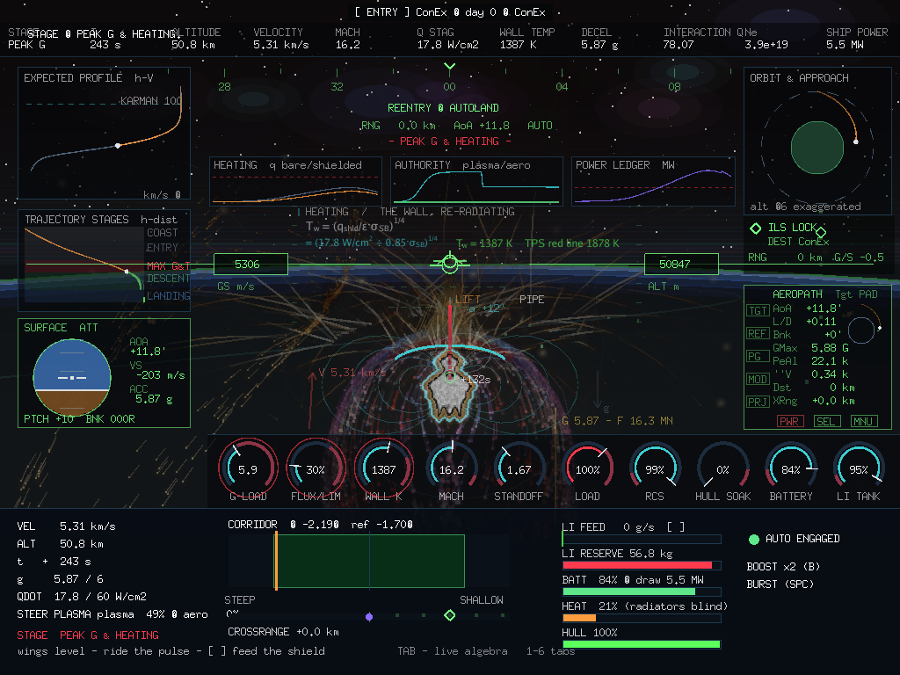
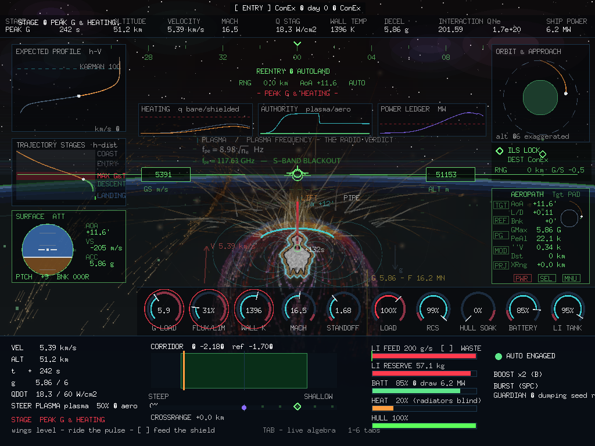
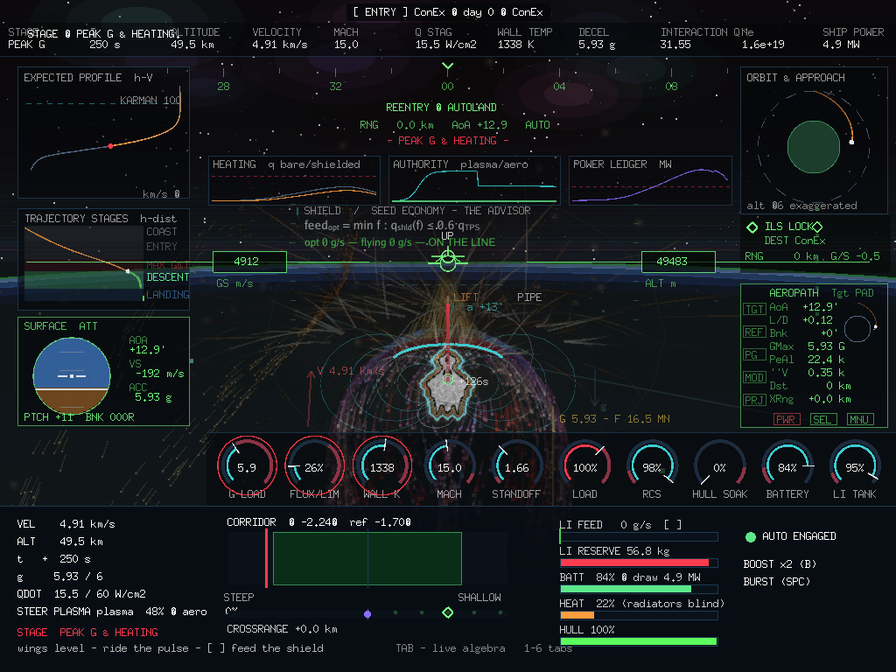

# LR-2026-06 — Algebra on the Sky: the Console's Six Tabs, Typeset in Flight

**Date:** 2026-09-01 · **Scope:** `gonex/internal/ui/mathtext.go`,
`gonex/internal/app/gpis.go`, `gonex/internal/reentry` (AdviseFeed) ·
**References:** the vendored MHD console's LIVE ALGEBRA rail
(`vendor/docs/reentry-console.html`), LR-2026-05.

The console prototype's numerical-flow tabs — CONCEPT, FLOW, HEATING,
PLASMA, SHIELD, POWER — walk each subsystem from formula through
substitution to result. This round puts that walk *inside the descent*:
the equations are typeset onto the black of the sky above the horizon,
recomputed from the live state every frame, touring block by block down
the corridor. And one of them is solved backwards into a flying aid: the
seed-economy advisor, the optimal-fuel / minimal-hull line drawn on the
LI FEED gauge.

## 1. Math typography in a bitmap-era cockpit (`ui/mathtext.go`)

The game's face is 7×13 ASCII; an equation wants ρ, a raised ², a
lowered subscript and a vinculum. The fix is a ~120-line TeX-ish layout
engine over the Go vector face (`gofont/goregular` through ebitengine's
`text/v2`), with three markers:

    _{...}   subscript        ^{...}   superscript
    √{...}   radical — the surd and vinculum are drawn with vector
             strokes over the radicand, so the bar always fits

`DrawMath` walks the runes, recursing one level for groups, drawing
plain runs at the base size and marked runs at 0.66× with baseline
offsets; `MathWidth` is the same walk with a nil destination. The Go
face carries Greek natively, so `ρ`, `γ`, `σ`, `Σ`, `χ`, `φ` are real
glyphs. One trap worth recording: the sub/superscript branch originally
did `x += mathRun(...)` — but `mathRun` returns the absolute end-x, not
an advance, so every equation truncated after its first subscript.
Bitmap-font prose has its own trap: basicfont renders `—`, `–` and `·`
as boxes, so panel prose stays ASCII while equations get the full set.

## 2. The sky layer

The first build was an opaque sliding side panel. The direction that
replaced it: *the algebra belongs to the black background*. The layer
now draws with no box at all, in the clear band between the HUD's speed
and altitude boxes, just above the horizon:

- one block at a time — label, equation, substitution → result — each
  holding ~6.5 s with an ease-in/out, touring all three blocks of all
  six tabs across the descent (a full tour ≈ the length of the entry:
  the flight lectures itself on the way down);
- visibility is *earned from the scene*: alpha scales with how black
  the sky actually is (`(h−15 km)/35`), with the horizon's headroom,
  and dissolves across the ILS seam — at low altitude the daylight
  simply washes it away, no toggle needed;
- `TAB` hides the layer (the full-map binding yields to it on the
  corridor only), `1–6` pins a tab for ~30 wall-seconds, then the tour
  resumes;
- `GONEX_ALG=1..6` pins a tab from the environment — the hook the
  documentation captures are taken through.

Every number is the sim's: the blocks call `reentry.Atm` and read
`Sim.Pt` directly, so the sky shows the same standoff, gate, flux, nₑ
and power the dials read — plus the derivations between them
(`f_pe = 8.98·√n_e = 117.6 GHz — S-BAND BLACKOUT` while the ILS lamp
sits at ACQUIRING).

## 3. The seed-economy advisor (`Sim.AdviseFeed`)

The SHIELD tab's teaching — the MHD gate is Q/(1+Q), and past the knee
extra electrons buy nothing — becomes a control-law aid. Each ~0.3 s
the game solves the envelope model backwards:

    feed_opt = min f : q_shld(f) ≤ 0.6 · TPS limit

by evaluating `stateAt` at eleven feed levels (cheap; the model is a
closed-form chain). The answer lands in three places:

- a **green caret on the LI FEED bar** — the optimal-consumption line;
- **verdicts on the bar's label**: `WASTE` when the gate is saturated
  and the feed is over the caret (grams buying nothing), `STARVED` when
  the sheath is hot and the feed is under it (hull paying instead);
- the SHIELD tab's third block, showing the solve as algebra.

The economy is real, not cosmetic: leftover lithium and hull percentage
are both scored at the pay screen, so flying the caret is literally
optimal fuel consumption and minimal hull damage. The honest surprise
the advisor surfaces: for most of the descent the optimum is *zero* —
below ~36 W/cm² the bare pillow suffices, and the seed exists for the
pulse. (The guardian's emergency dump still flags WASTE, correctly: the
reflex buys safety with lithium, and the gauge says so.)

## 4. What the six tabs mean at the stick

- **CONCEPT** — standoff `(p_mag/p_ram)^{1/6}`, the free brake `D·V`,
  the corridor wedge: the mental model. The stick flies the wedge, the
  coil flies the heat.
- **FLOW** — ρ(h) is the master variable; M, q_dyn, Kn, T₂ all follow.
- **HEATING** — the V³ law is why the corridor spends velocity high;
  FLUX/LIM and WALL K are this tab with needles.
- **PLASMA** — `[ ]` buys electrons; blackout is physics, not a fault.
- **SHIELD** — the gate's knee; fly the feed caret.
- **POWER** — megawatts of bill against gigawatts of free braking; a
  full battery is part of the flight plan.

## Cost

The layer is text and a few strokes per frame; the advisor is eleven
closed-form evaluations per 0.3 s; the math faces are cached per size.
`go vet` clean, all suites green; gonex 8f72e19.
