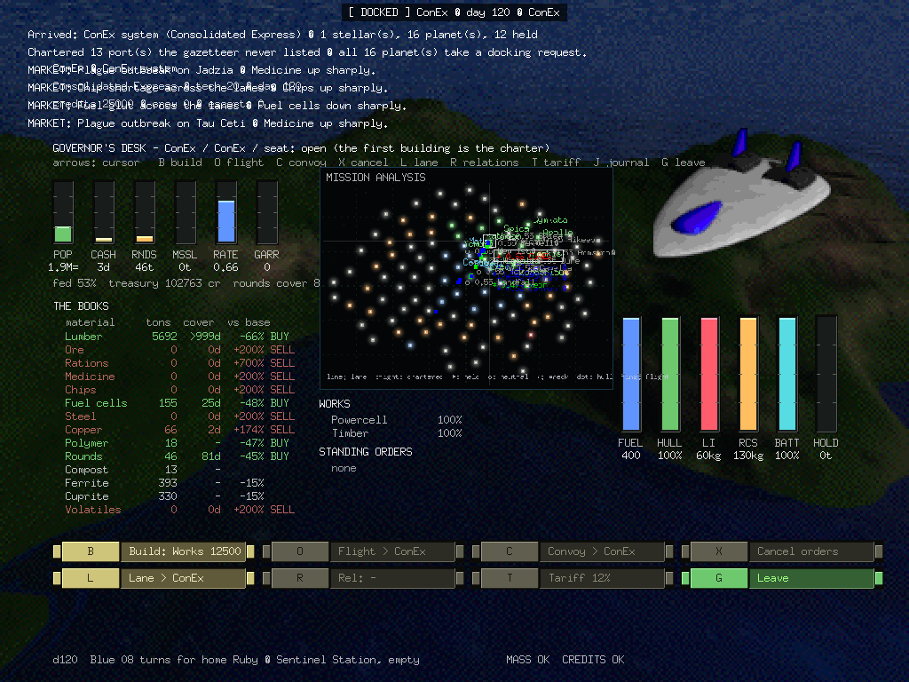
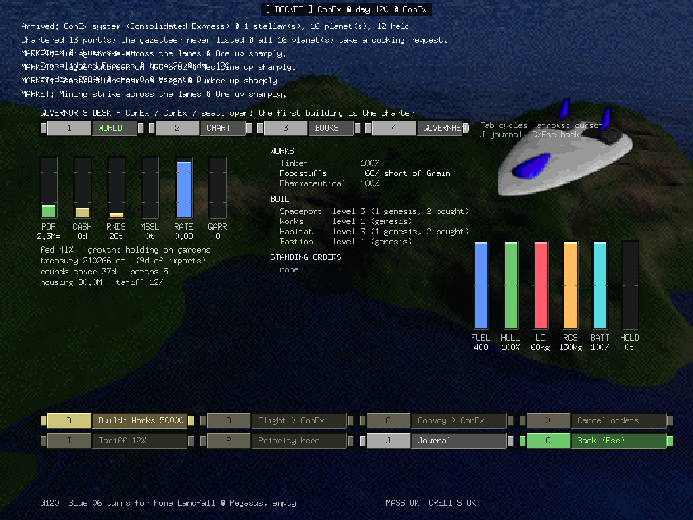
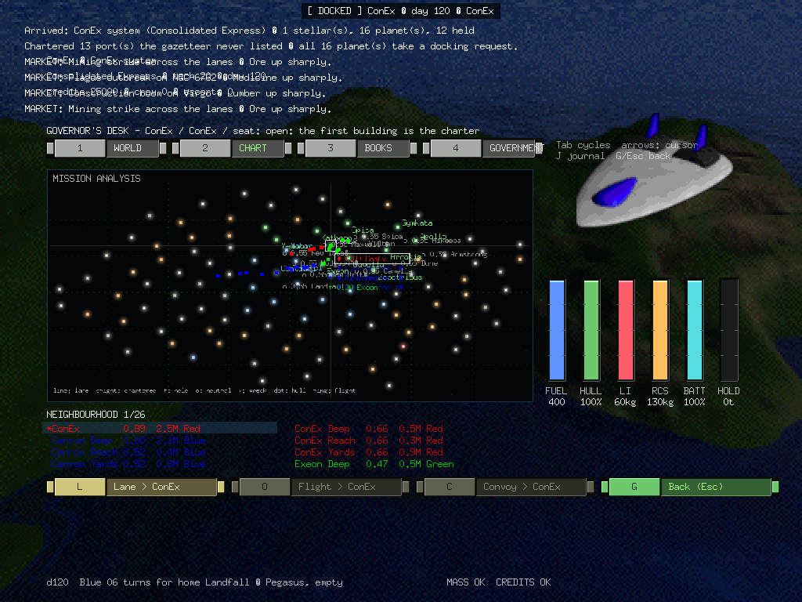
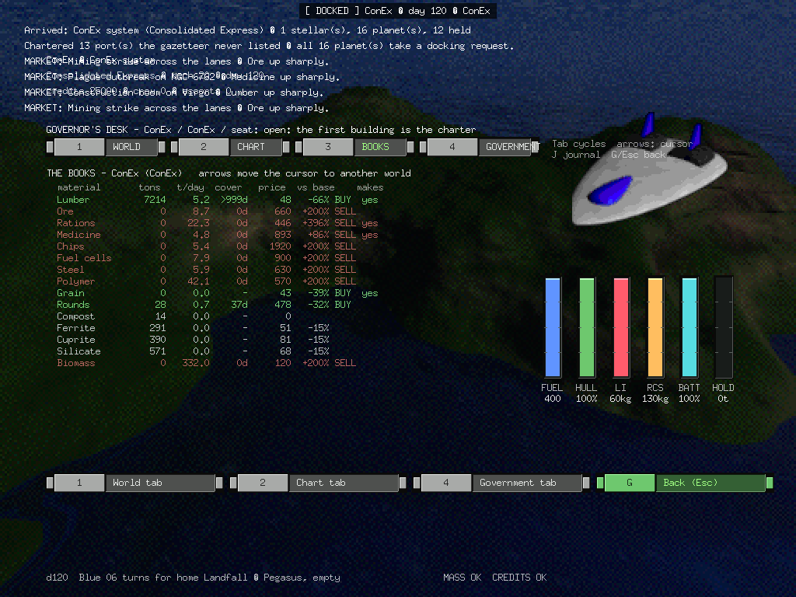
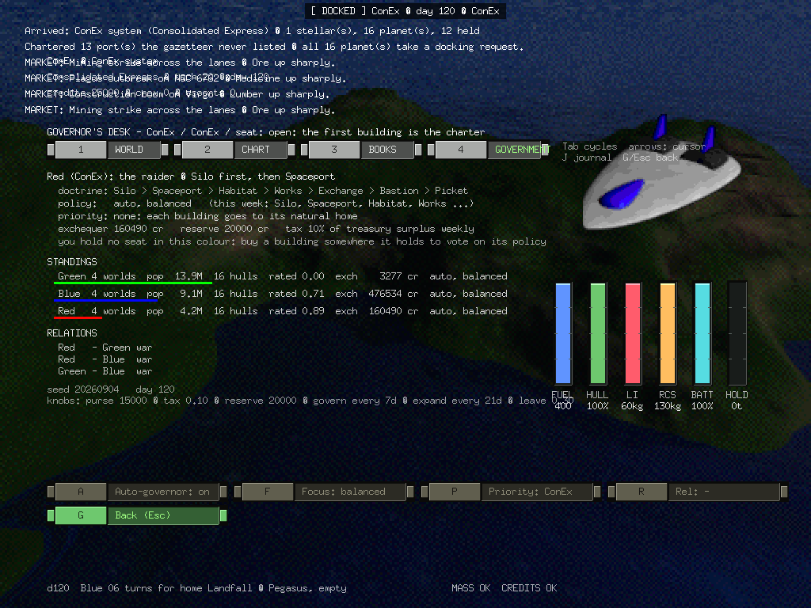

# LR-2026-07 — The Governor's Desk: One Screen for a World That Is a Market, a Factory and a Fortress

**Date:** 2026-09-04 · **Scope:** design, and the implementation plan for
`gonex/internal/app/governmode.go` (a new `dockGovern` view),
`gonex/internal/universe/{battle,orders}.go` ·
**References:** [docs/resource-cycle-plan.md](../resource-cycle-plan.md),
[docs/trade-economy-plan.md](../trade-economy-plan.md),
[docs/war-economy-plan.md](../war-economy-plan.md), OpenFront
`src/core/configuration/Config.ts` and `src/core/execution/{Port,TradeShip,Train}Execution.ts`,
KDE Konquest `src/game.cpp` and `src/planet.cc`.

This round shipped the code — §8 below records what — but the report is
about how the screen was arrived at. It took three games apart — our own conserved
trade economy, OpenFront's building-and-alliance network, and KDE Konquest's
four-rule conquest loop — and asked one question of every mechanic in each:
*what number would a person running this world need to see?* The answers,
collected, turned out to be a single screen. This report records how each
idea became an element on it, draws the screen, and lays out what has to be
built underneath it.

ConEx was always two games wearing one hull: a **commodity trader**, and a
**territorial government** fighting for worlds. The dock today serves the
first well (counter, yard, bar, the journal wall) and the second not at all —
territory is fought over in the deathmatch and *administered* nowhere. The
Governor's Desk is the missing dock view: the place where a player who has
bought into a world stops being a courier and starts being a colour.

---

## 1. Three games, one question

### 1.1 What gonex already knew

The trade economy is zero-sum in mass and audited every tick. It produces,
without anyone authoring it, exactly the quantities a governor cares about:
what the world makes (`Speciality`), what it is short of (the plant running
at 68% *short of grain*), what it is worth per ton today (`Shop`), how many
days of cover the warehouse holds, and who is inbound with what. All of it is
on the journal wall already — as prose, for a courier deciding where to fly
next. The desk shows the same numbers to the person who decides *what the
world does about them*.

The resource-cycle plan adds the rest of the column: a credit ledger as strict
as the mass books, Hull and Rounds and Missiles as tons, growth made of
rations, pilots with purses. Every one of those is a gauge.

### 1.2 What OpenFront contributed

Not its accounting — its gold is minted at both ends of every voyage, and the
plan rejects that outright — but three *shapes*:

- **Same-type connectivity.** Port talks to Port by sea; Factory, City and
  Port talk by rail. In space: Spaceport ↔ Spaceport by interstellar courier,
  Works ↔ Works / Habitat / Spaceport by in-system shuttle. The desk's chart
  has to show *which* links exist, because that is what a building buys.
- **One shared cost ladder.** Port and Factory share a counter; the second of
  either costs the second rung. The desk shows the ladder with the *next*
  rung priced, because the whole decision is "is this one worth this much".
- **Relations change the network's value.** Allied ports are chosen 4× as
  often; war closes a route. The desk needs a relations control and the
  chart needs relation colouring — a route that vanished because of a war
  must look different from one that vanished because the price moved.

### 1.3 What Konquest contributed

Konquest is a conquest game in 857 lines, and its four rules survive contact
with a conserved economy better than anything in OpenFront:

```cpp
// game.cpp
production      = 5 + rand(10)            // ships per turn per planet, static
killPercentage  = 0.30 + rand(0.60)       // per planet, static
// doFleetArrival: loop until one side is 0
if (defenderRoll < defenderPlanet->killPercentage()) makeKill(attacker);
if (attackerRoll < attackerPlanet->killPercentage()) makeKill(&defender);  // attacker uses the planet it LEFT
// planet.cc: conquer()
m_homeFleet.become(conqueringFleet);      // the garrison IS the arriving fleet
```

And the play advice the community wrote around them — *capture neutrals for
production; attack low-kill planets from high-kill ones; never send fewer than
ten; ships cannot stop in transit; set standing orders* — is a checklist of
what the player must be able to **see** and **do**. Production, a defence
rating for every planet on the map (yours *and* theirs), fleets in transit
with arrival days, and a standing-order control. Four more elements.

The resource-cycle plan §7b maps each Konquest constant onto a quantity the
cycle already produces: production is Yard tons per day, throttled by
supplies; kill percentage is a **defence rating** that goes to zero when the
magazine is empty; the standing order is one mechanism with OpenFront's
train. The desk is where those mappings are visible.

### 1.4 The table

| Idea | Source | Element on the desk |
| --- | --- | --- |
| Population, and whether it is fed | gonex (§4 of the plan) | POP tank with growth arrow and `fed %` |
| Treasury; can it still import | plan §2 | TREASURY tank with "days of imports" |
| Plants, throughput, bottleneck | `industry.Module` | WORKS list: `Electronics 96% [Silicon]` |
| Yard output, what it is short of | plan §5 | YARD line: `Hull 12 t/d · short Chips` |
| Warehouse cover, price vs base | `Reprice` | BOOKS column: material · tons · cover · price · Δbase |
| Defence rating | Konquest kill% | RATING badge, on this world and on every world in the chart |
| Magazine | war economy M1, plan §1 | ROUNDS and MISSILES tanks |
| Garrison | Konquest "one must remain" | GARRISON count in orbit, with colour |
| Fleets in transit, ETA | Konquest + `traffic` integrator | inbound/outbound arrows on the chart, ETA in days |
| Debris to salvage | plan §6 | ◌ marker on the chart with tons |
| Which links exist, and of what type | OpenFront same-type | chart edges: solid courier lanes, dashed shuttle links |
| Relation per colour | OpenFront war/ally | chart colouring; RELATIONS keycap |
| Next rung of the ladder | OpenFront cost counter | BUILD menu with the price of the *next* building |
| Standing order | Konquest retry-send / OpenFront train | ORDER keycap: from → to, N hulls or tons per day |
| Mass and credits balanced | `econ.Books`, `econ.Ledger` | one status line at the foot: `MASS ✓ CREDITS ✓` |

Fifteen elements. Nothing on the screen exists because it was pretty; each
row above is a decision somebody makes.

---

## 2. The screen

The Ares grammar the dock already speaks — bezelled tanks in a sidebar rail,
green and khaki keycaps along the foot, a chart-table starmap with a
crosshair — is enough. Four regions:

```
┌────────────────────────────────────────────────────────────────────────────────────────────┐
│ GOVERNOR'S DESK — ConEx station · Levo system · RED · day 357        seat: YOURS (charter) │
├────────────┬───────────────────────────────────────────────┬───────────────────────────────┤
│ THE WORLD  │ THE CHART                                     │ THE BOOKS                     │
│            │                                               │ material   tons  cover  Δbase │
│ ▐POP    ▌  │        Exeon ◆ 0.71        Cenron ◆ 0.83      │ Fuel cells  412   31d  −38%  ▲│
│  4.31 M    │         (Green)    ╲      (Blue)              │ Copper       61    4d  +140% ▼│
│  fed 97% ▲ │                ╲    ╲  ····                   │ Rations     880   22d  −12%   │
│            │      Kestrel ◇ 0.12  ╲ ╲ ····  ◌ 34t          │ Chips         0    0d  +200% ▼│
│ ▐TREASURY▌ │       (neutral)       ╲╲                      │ Steel       120    9d  +31%   │
│  1.04 M cr │           ─ ─ ─ ─ ─ ─ ─ [ConEx ◆ 0.86] ─ ─ ─  │ Rounds       18    2d  +190% ▼│
│  38d imprt │                        ╱  ╲       Sula ◇ 0.44 │ Hull         40    —          │
│            │        Green 08 ▶ 3d  ╱    ╲ ◀ Red 04 · 5d    │ …                             │
│ ▐ROUNDS ▌  │                     ╱        ╲                │                               │
│  18 t  2d  │        ─── courier lane   ··· shuttle link    │ WORKS                         │
│ ▐MISSILE▌  │        ◆ held  ◇ neutral  0.86 = rating       │ Powercell     100%            │
│  0 t   —   │        ◌ debris  ▶ inbound  ◀ outbound        │ Electronics    72% [Silicon]  │
│            │                                               │ Arsenal        22% [Polymer]  │
│ RATING     │                                               │ YARD  Hull 12 t/d · no Chips  │
│  0.86      │                                               │                               │
│ GARRISON   │                                               │ STANDING ORDERS               │
│  7 hulls   │                                               │ ▸ Cenron → here  Copper 40t/d │
│            │                                               │ ▸ here → Kestrel  3 hulls/d   │
├────────────┴───────────────────────────────────────────────┴───────────────────────────────┤
│ [B] Build · next: WORKS 25,000   [O] Standing order   [L] Charter lane   [R] Relations     │
│ [T] Tariff 12%                  [J] Journal          [←] Leave                             │
│ d357  Red 04 delivers 34t Copper at ConEx for 3,993 cr (margin 1,518)   MASS ✓  CREDITS ✓  │
└────────────────────────────────────────────────────────────────────────────────────────────┘
```

### 2.1 The World (left rail)

Five bezelled tanks in the sidebar style `drawDock` already draws for FUEL,
HULL, LI and RCS — the same widget, different fluids:

- **POP** fills against the largest population in the gazetteer, with the
  growth arrow computed from `fed` (plan §4): ▲ above 85% fed, ▼ below.
- **TREASURY** fills against the world's genesis credits and prints *days of
  imports* — treasury ÷ yesterday's import bill — because "can this world
  still buy" is the question, not the number.
- **ROUNDS** and **MISSILES** in tons, with cover in days at the current burn.
  These are what the defence rating is made of, so they sit directly above it.
- **RATING** is Konquest's kill percentage, made honest:

  ```
  rating = Gunnery(colour) · (1 + 0.5·bastionLevel) · min(1, roundsCover / 3 days)
  ```

  It is drawn the same way on every world in the chart, friend or foe, from
  the same function. A fortress with an empty magazine reads 0.00 and is
  meant to.
- **GARRISON** is the armed hulls in orbit, coloured. A zero here with an
  enemy flight inbound is the whole of Konquest's "one ship must remain" as
  a single red number.

### 2.2 The Chart (centre)

`drawMissionChart` already draws the neighbourhood with a chart-table
crosshair; the desk reuses it and adds five overlays:

1. **Edges by type.** Solid lines are courier lanes (Spaceport ↔ Spaceport —
   any jump link between two held or neutral ports). Dotted lines are
   shuttle links (Works ↔ Works/Habitat/Spaceport, same system or a
   chartered Lane). A link that war has closed is drawn broken.
2. **Rating badges** next to every name: `◆ 0.86`. Filled diamond for a held
   world, hollow for neutral, tinted by colour. This is the element Konquest's
   best advice depends on.
3. **Fleets in transit** as arrows on the lane with the hull's name and ETA
   in days, from the momentum integrator — so a laden assault flight visibly
   arrives later than an empty courier on the same lane.
4. **Debris** as ◌ with tons, wherever a hull died and nobody has collected.
5. **Standing orders** as a doubled arrow between their endpoints.

The player's cursor walks the chart; the right column re-targets to whatever
world is under the crosshair, so you can read Cenron's books from ConEx's
desk — at the resolution your relation allows (§5).

### 2.3 The Books (right column)

The full material vector, not just the six board goods: the intermediates
matter to a governor because they are what the shuttles carry. Each row:
tons on hand, days of cover, and **Δbase** — today's price against
`baseValue`, coloured. A red ▼ is where couriers make their money selling to
you; a green ▲ is what you should be shipping out. Beneath: the WORKS list in
`industry.Module` terms with the bottleneck material in brackets, the YARD
line, and the world's standing orders.

### 2.4 The Desk (foot)

Keycaps in the dock's khaki and green, the journal ticker, and the two
auditors' verdicts. The verdict line is not decoration: a red ✗ there means a
tick moved tons or credits that no pool now holds, and it will be the first
place anyone looks when the numbers stop making sense.

---

## 3. Reading the screen like Konquest

Konquest's play advice, run against the desk:

| Advice | What you look at |
| --- | --- |
| *Capture neutrals for production* | the hollow ◇ worlds' POP and YARD lines under the cursor; a neutral with a big population and no garrison is the target |
| *Attack low-kill from high-kill* | the rating badge on the target against your **Arsenal** throughput at home — the flight inherits the magazine it loads here |
| *Never send fewer than ten* | GARRISON on the target, and the arrows already inbound to it |
| *Ships cannot stop in transit* | the ETA on your own outbound arrow; there is no recall keycap, on purpose |
| *Set standing orders* | `[O]` |

The screen turns the folklore into readings.

---

## 4. The desk actions

Every action is a transfer, priced from one ladder, paid from a named purse.

**`[B]` Build.** Opens the eight-building menu from the plan §8 with the next
rung of each ladder priced. Spaceport and Works share a counter (12,500 →
25,000 → 50,000 → 100,000); Habitat and Exchange share another; Lane is
`5,000 · jumps`; Bastion, Picket and Silo are 20,000 flat and draw Steel from
the warehouse when built. Payment is `econ.Pay(&voy.Credits, &world.Credits,
cost)` — the player's money enters the world's treasury and stays in the
ledger. A built Works appears in WORKS the next tick with `Rank`'s next chain.

**`[O]` Standing order.** Konquest's retry-send and OpenFront's train, one
control: pick a destination on the chart, pick *hulls per day* (an assault or
a garrison transfer) or *tons per day of a material* (a convoy), confirm. The
order lives on the world (`universe.StandingOrder`), is executed by
`dispatch` before free routing, is cancelled when the world changes hands
(as Konquest's `conquer` deletes standing orders), and shows on the chart
and in the BOOKS column until then.

**`[L]` Charter lane.** Buys a shuttle-grade link across one jump so Works on
adjacent systems trade intermediates. Drawn dotted on the chart the moment it
is paid for.

**`[R]` Relations.** Only at a colour's capital, and only for the seat-holder:
war, peace, alliance with each other colour. Alliance doubles the destination
weight for couriers both ways and zeros the tariff; war closes every lane
between the two colours and turns the hulls on them for the nearest friendly
port, cargo aboard, unpaid.

**`[T]` Tariff.** The rate this world charges on sales by non-allied couriers,
default 12% own / 6% neutral / 0% allied, into the colour's exchequer. It is
the only lever a governor has on the *money* side, and the trade-off is
visible on the chart within a week: raise it and the inbound arrows thin.

---

## 5. Who sits at the desk

The player is a courier first. The seat is earned, not granted:

- **Visitor.** Any world you land on shows the desk **read-only**, at the
  resolution your relation allows: your own colour's worlds in full; neutral
  and allied worlds without the standing orders and with the treasury as a
  band rather than a number; enemy worlds show only what a ship in orbit
  could see — population, rating, garrison. That last is Konquest's rule that
  you can see every planet's kill percentage, kept.
- **Governor.** Buy the first building at a world and the seat is yours: the
  keycaps go live, and the colour's AI stops making decisions for that world.
  The AI keeps governing everything else with the same menu and prices. Lose
  the world to another colour and the seat is gone with the standing orders.

That single rule — *the first building is the charter* — is what makes ConEx a
trader who becomes a government by trading well, rather than a government who
occasionally trades.

---

## 6. Implementation

### 6.1 New simulation surface (`internal/universe`)

```go
// orders.go
type StandingOrder struct {
    From, To int             // stellar IDs
    Hulls    int             // per day, or
    Mat      econ.Material   // …tons per day of this
    Tons     float64
    Owner    govt.Color
}
func (u *Universe) Standing(from int) []StandingOrder
func (u *Universe) Order(o StandingOrder) error       // validates the link type: courier vs shuttle
func (u *Universe) runOrders()                        // in Tick, before flyFleet's free routing

// battle.go — Konquest's loop, spending Rounds, leaving Scrap
func (u *Universe) Rating(w *World) float64
func (u *Universe) Engage(flight []*traffic.Hull, at *World) Outcome
//   each roll: econ.Consume(&shooter.Rounds, &u.Sink, econ.Rounds, roundTons)
//   each kill: econ.Transfer(hull.Dry → u.Debris[at].Scrap)  — Dry is a Hull-material pool
//   on fall:   at.Govt = flight colour; at.Orders = nil; garrison := flight

// world.go additions
type Building int   // Spaceport, Works, Habitat, Exchange, Lane, Bastion, Picket, Silo
Buildings map[Building]int   // level
Tariff    float64
Seat      Seat               // AI | Player

// relations, on Universe
Relation(a, b govt.Color) Relation   // War | Peace | Ally
```

`Rating` is the one function both the desk and `Engage` call, so what the
badge shows is what the roll uses. That is the same discipline as the war
economy's single `Service()` for both landing paths, for the same reason: two
computations of one number drift.

### 6.2 The view (`internal/app/governmode.go`)

- `dockGovern` joins the `dockView` enum; `[G]` from `dockMain` opens it,
  `[J]` from it opens the journal, `[←]` returns.
- `updateGovern` moves the chart cursor over the neighbourhood's stellars
  (reusing `drawMissionChart`'s layout), and dispatches the keycaps; every
  mutating action goes through one `a.govern(action)` that checks the seat,
  prices the action, and calls `econ.Pay` — there is no second path that
  spends credits.
- `drawGovern` draws the four regions. The left rail is the existing tank
  widget; the chart is `drawMissionChart` plus the five overlays; the books
  column walks `econ.Count` materials with `Shop[m]/baseValue[m]`.
- `GONEX_BOOT="dock 133 govern"` opens straight onto it, matching the
  journal's boot hook; `GONEX_SHOT` frames it for the recordings.

### 6.3 Console

```
govern [id]                 print the desk as text — the headless form of the screen
order <from> <to> hulls N | tons <material> N
build <building>            at the docked world
relate <colour> war|peace|ally
rating [id]
```

`GONEX_CMD="day 200;govern 133"` is how the balance work will actually be
done, exactly as `economy` and `journal` are today.

### 6.4 Tests

- `TestRatingIsZeroWithoutRounds` — a Bastion with an empty magazine rates 0.
- `TestEngageConserves` — a fight between 12 and 9 hulls leaves the grand
  mass total unchanged and Scrap equal to the Dry tons of the dead.
- `TestStandingOrderCancelsOnConquest` — Konquest's `deleteStandingOrders`.
- `TestLadderIsShared` — a Spaceport then a Works prices the Works at rung 2.
- `TestSeatFollowsCharter` — the first building flips `Seat` to the player;
  losing the world flips it back.
- `TestGovernRenders` — headless draw of the desk for a seeded universe at
  day 200, no panic, every region non-empty. The screen is part of the
  simulation's test surface, as the sky tabs are.

### 6.5 Milestones

| # | Slice | Observable |
| --- | --- | --- |
| **G1** | `Rating`, `Relation`, rating badges and relation colours on the existing mission chart | you can see, from any dock, who is strong and who is at war |
| **G2** | The desk view read-only: rail, chart overlays, books, verdict line | `GONEX_BOOT="dock 133 govern"` shows the world; `govern 133` prints it |
| **G3** | `[B]` and the seat; `Pay` into the treasury; AI governs the rest with the same menu | buy a Works at Kestrel; next week it exports lumber it did not before |
| **G4** | `[O]` standing orders, `Engage`, garrison flip; `[L]`, `[R]`, `[T]` | set 3 hulls/day at a neutral; watch the arrow, the ETA, the roll on the ticker, and the badge turn your colour |

G1 needs only R2 from the resource-cycle plan (Rounds as a material). G2 is
pure interface over what exists. G3 needs R1 (the ledger). G4 needs R5
(somewhere for Scrap to go) and R7.

---

## 7. What is deliberately not on the screen

- **No dividend.** An upgrade buys a claim on *flow* — more couriers basing
  here, a deeper market, a stronger defence — never a payout. Zero-sum cannot
  pay one, and the screen should not imply it can.
- **No recall.** Konquest's rule. An outbound arrow is a commitment; the ETA
  is the only thing you get.
- **No hidden multiplier.** Every number on the rail is a function the
  console can print. If a value on the desk cannot be reproduced by a
  `GONEX_CMD` line from the same seed, it does not belong on the desk.
- **No map painting.** OpenFront's tile-clicking territory game is the part
  you said we do not want. Territory here is a world, held by whoever keeps a
  garrison and a supplied magazine over it; the chart shows that state, it
  does not let you paint it.

---

## 8. What shipped

Everything in §6 landed the same day, plus the resource cycle underneath
it (see [the plan's §11](../resource-cycle-plan.md#11-as-built--4-september-2026)).



The frame is `GONEX_BOOT="dock 133 govern" GONEX_CMD="day 120" GONEX_SHOT=…`
on the full gazetteer. Read it against the wireframe in §2:

- **THE WORLD** rail reads `POP 1.9M=` (holding on gardens at 53% fed),
  `CASH 3d` (three days of imports in the treasury), `RNDS 46t`,
  `RATE 0.66`, `GARR 0` — a capital with a good rating and nobody home,
  which is exactly Konquest's warning.
- **THE BOOKS** for the world under the cursor, red `SELL` where the port
  pays over base (rations at +700% is the famine), green `BUY` where it
  sells under.
- **THE CHART** carries the badges, capped at four a star with the cursor's
  always drawn; the legend is ASCII because the 7×13 face renders `◆` as a
  box — LR-2026-06's lesson, re-learned once.
- **THE DESK** is eight keycaps in two rows; dimmed ones need the seat.
  `MASS OK  CREDITS OK` at the foot is both auditors, live.

The headless form prints the same numbers:

```
GONEX_CMD="day 120;govern 133;standings"
- GOVERNOR'S DESK — ConEx · ConEx · seat: the government · day 120
  pop 1.91M fed 53% · treasury 102763 cr · rounds 46t · missiles 0t · rating 0.66 · garrison 0 · berths 1
  works: Powercell 100%
  works: Timber 100%
  books:
    Lumber          5692t  cover >999d     48 cr/t  -66% vs base
    Rations            0t  cover    0d    720 cr/t  +700% vs base
    …
- Blue  4 worlds · pop 6.6M · 16 hulls · treasuries 1635189 cr · exchequer 0 cr · capital rated 0.52
- Red   4 worlds · pop 3.8M · 16 hulls · treasuries  397591 cr · exchequer 0 cr · capital rated 0.66
  ledger balanced: 111428491 cr in circulation
```

### Two things the screen taught

**The population collapse.** The first year-long run of the new growth
rule emptied every world that had no farm: ConEx 4.2M → 0.0M. Nothing on
the old journal wall would have said why. The desk's `POP` tank with its
`fed %` said it in one glance, and the fix — civic Gardens on every world
with soil, fed before the mills — was obvious once the number was visible.
That is the argument for the screen, made by the screen.

**The silent fleet.** On the full gazetteer the first 120-day run landed
no cargo at all. `hauling 0 · returning 27` on the `economy` line was the
tell: forty-eight pilots deadheading between ports for parcels their
3,000-credit purses could not buy. The ledger was balanced the whole time.
A conserved economy can be perfectly honest and perfectly still; the
standings and the rail are what tell you which.

### Tests added

`internal/universe/cycle_test.go` — credits conserved over 400 days on
four seeds; wreck cargo never lost; nearest hold scoops first; an
undefended world falls and a fortress holds, both conserved; rating is zero
without rounds; a standing order runs and dies with the government; copper
needs a lane; the ladder is shared and the seat follows the charter; growth
is made of rations; the organic loop closes; yards replace lost hulls.

---

## 9. Second round: four tabs

The one-screen desk was judged to have too much going on, and it did. The
same fifteen elements are now four tabs — `1`–`4` or Tab — each with its own
keycaps, one cursor shared by all of them, and the verdict line at the foot
of every tab.



**1 WORLD** — the six tanks (POP with fed sign, CASH as days of imports,
RNDS, MSSL, RATE, GARR), four lines of readings, WORKS with the bottleneck
named, BUILT with genesis levels marked, STANDING ORDERS. Keycaps: build,
flight, convoy, cancel, tariff, **priority**.



**2 CHART** — the mission computer's map at full width with the five
overlays, and a NEIGHBOURHOOD list of eight rows around the cursor (rating,
population, colour). Keycaps: lane, flight, convoy.



**3 BOOKS** — the full material vector for the world under the cursor:
tons, tons a day, cover, price, price against base as BUY/SELL, and whether
the world makes it. A stranger's world shows only what a ship in orbit could
see.



**4 GOVERNMENT** — the colour's doctrine read off the trifecta, its policy
and this week's plan, the priority world, the exchequer and tax, the
standings with population bars, relations, and the seed and knobs. Keycaps:
**A** auto-governor on/off, **F** focus, **P** priority, **R** relations —
all live once you hold a seat anywhere in the colour.

### The auto-governor

Every colour runs one. It taxes its worlds' surplus into an exchequer,
subsidises the ones that cannot cover imports, and once a week buys the
first building in its doctrine it can afford — at the priority world if one
is named — then invests by focus and, every three weeks, sends a flight at
the softest unaligned world if it out-rates it. The player elects into it by
buying a building: a seat in a colour is a vote on its policy. Switch it to
manual and the exchequer waits for you.

### What this round taught

**Genesis must not count.** Giving every world a Spaceport broke "the first
building is the charter" and moved every player's first purchase to rung
two. `Endowed` alongside `Built` fixed both: built is what stands, bought is
what the ladder and the seat see.

**The neighbourhood list ran into the fuel gauges.** The dock's own furniture
owns the right third of the screen from `y=356` down; a list on the CHART
tab that did not know that overlapped the tanks in the first frame. Eight
rows around the cursor fit above them.
