# Plan: The Resource Cycle

**Tons are conserved. Credits are conserved. Only life compounds.**

The [trade economy](trade-economy-plan.md) gave the game one conservation law:
mass. Every ton was put in the ground at genesis and can only move. That law
is the spine of this plan too, and this plan adds the second one the game has
been quietly missing — **credits are conserved as well** — and then closes
every loop that today ends in a hole: wrecks that vanish into slag, hull
margins that evaporate on arrival, ships and bullets that are bought with an
abstract "industrial point" instead of pressed from steel, and a population
that grows on a flat percentage whether or not anybody fed it.

The reference you pointed at is Concept Game (the rules you pasted are Concept Game's;
the WarFront client it forked from has no trade code at all — it is a pure
territory-painting game, `src/game/attack`, `src/game/boat`, nothing else).
Concept Game is worth studying for its *shape* — same-type connectivity, one
shared cost ladder, alliances that make a network more valuable — and worth
rejecting for its *accounting*. Its trade is positive-sum on purpose:

```ts
// Concept Game src/core/configuration/Config.ts
tradeShipGold(dist)  = 75_000 / (1 + e^(-0.03·(dist − 300))) + 50·dist   // minted, to BOTH ends
trainGold(rel)       = self 10_000 · other 25_000 · ally 35_000           // minted, at EVERY stop
```

Nobody pays that gold. It is created at the moment of arrival, which is the
right design for a twenty-minute land grab and the wrong one for a courier
simulator whose whole promise is that a cargo is *somebody's*. So every rule
below is a **transfer**: whatever one pool gains, another pool lost.

---

## 0. What exists, and where it leaks

| | Have | Leak |
| --- | --- | --- |
| Mass | 17 materials, `econ.Books` auditor, `universe.produce` as the only transformer | none — BALANCED across 800 days, four seeds |
| Population | `Pop` scales mine budget, plant rate, IP regen, berths | grows at a flat `GrowthPerDay` capped at `popCeiling`; food only *stops* growth, never causes it |
| Credits | world treasuries `Credits = pop/4`, player starts on 8,000 | **minted and burned freely**: a hull's margin is logged and discarded at `arrive`; `PadBonus` and `boomFine` appear from and vanish to nowhere; everything the player buys at the counter and the pad goes to no treasury |
| Ships | fixed census, `Dry` mass per hull, `PlateDraw` for repairs | a new hull costs 60 abstract IP; **hull mass is outside the books** |
| Munitions | `Rounds`, `RoundCr = 3`, IP per twenty rounds | bullets have a price and no mass; nobody makes them |
| Wrecks | `World.OnKill` scatters cargo into the sink (T5) | the cargo is *gone* — the exact opposite of what a courier game wants |

The mass side is finished. Everything below is about giving the other three
columns the same discipline, then drawing the whole thing as one cycle.

---

## 1. The rule of one-to-one

Your ask was "full convertibility at a 1:1 ratio". There is exactly one unit
in this game that every resource already shares, and it is the **ton**. So the
rule is:

> **Every conversion in the game takes N tons in and puts N tons out.** What
> does not come out as product comes out as waste, and waste is counted.

That is already how `industry.Module` and `universe.produce` work; the
`drawn − made → Slag` line is the rule. This plan extends it to the four
things that are currently *not* tons: ships, bullets, missiles and people.
Three of them become materials. The fourth is treated specially, in §3.

### New materials

Five additions to `econ.Material`, in two new tiers:

```
yard      Hull      Rounds    Missiles         made from goods; what a fleet is made of
return    Compost   Scrap                       the two sinks that are not graves
```

| Recipe (per ton in) | In | Out | Waste |
| --- | --- | --- | --- |
| **Yard** | 0.70 Steel + 0.20 Chips + 0.10 Fuel cells | 0.90 Hull | 0.10 |
| **Arsenal** | 0.60 Steel + 0.40 Polymer | 0.90 Rounds | 0.10 |
| **Missile works** | 0.50 Steel + 0.20 Chips + 0.30 Polymer | 0.85 Missiles | 0.15 |
| **Composter** | 1.00 Compost | 0.60 Biomass *(to the reserve)* | 0.40 |
| **Breaker's yard** | 1.00 Scrap | 0.75 Steel | 0.25 |
| **Reclaimer** *(late, optional)* | 1.00 Slag | 0.15 Ferrite + 0.05 Silicate | 0.80 |

Yields are first guesses in the same spirit as the existing catalogue; the
shapes are what matter:

- **Hull is a material.** A ship's `Dry` tonnage is Hull tons that left a
  warehouse. Build a hull and the warehouse gets lighter by exactly what the
  ship weighs. Now `traffic.Hull.Dry` is a pool the auditor counts.
- **Rounds and missiles have mass**, so a magazine is cargo. A fighter that
  lands to rearm is *loading*, and a planet that cannot make Rounds needs them
  delivered — which is the supply line the war economy promised, made literal.
- **Compost is the rain.** Today everything the population eats goes to Slag
  and is dead forever, which makes food a non-renewable resource and is why
  reserves fall monotonically. Organic consumption (Rations, Medicine, Lumber)
  should go to Compost instead, and a farm world turns Compost back into
  Biomass *in the ground*. Minerals stay finite; life cycles. That is the
  actual water cycle, and it is the one place the sink flows back uphill.
- **Scrap is a wreck.** A dead hull's Dry tons become Scrap, not Slag, and a
  breaker's yard turns Scrap back into Steel. The battlefield feeds the
  shipyard, as the war economy's §5 wanted — but through the books.

### Energy is the sun

Ships need energy, fuel and weapons. Fuel and weapons are tons; **energy is
deliberately not**. It is the exogenous input that drives the cycle, exactly
as sunlight drives the water cycle: a planet generates it in proportion to its
population, it cannot be stored except by making Fuel cells (which *are*
tons), it cannot be shipped, and it is never refused at a pad. The war economy
already learned this the hard way when metering power per megajoule made a
squeezed planet refuse *energy* first. Keep power a utility. The only place
energy touches the books is as a *rate limit* on the Reclaimer, which is why
that recipe can exist without being a mint.

### Convertibility

With the two return paths, every material is reachable from every other:

```
crust ─mine→ warehouse ─plant→ refined ─plant→ goods ─yard→ hull/munitions
  ▲                                              │              │
  │◀── composter ◀── Compost ◀── consumption ◀───┘              │
  │                                                             │
  └◀── reclaimer ◀── Slag ◀── every process waste               │
                     Scrap ◀── wrecks ◀─────────────────────────┘
                        └─breaker→ Steel
```

There is no pair of materials without a path between them, and every edge is a
1:1 mass edge. The **price** of a good is then just the market's running
estimate of how many tons of waste the path to it costs — which is exactly what
`baseValue` is already approximating by hand.

---

## 2. Three books

| Book | Conserved? | Auditor | Genesis |
| --- | --- | --- | --- |
| **Mass** | yes, absolutely | `econ.Books` — exists | Σ endowments |
| **Credits** | yes, absolutely | `econ.Ledger` — **new** | Σ `pop/4` over worlds; the player's 8,000 is *debited from the home world* |
| **Population** | **no** | none, by design | gazetteer |

Population is the one thing in the game allowed to compound, because it is the
one thing that is alive. Everything else is zero-sum. That asymmetry is the
design: two conserved fluids and one living pump.

### The credit ledger

Same shape as `Books`: record genesis, roll every purse into one column,
compare. The purses:

- every `World.Credits` treasury
- every hull's **purse** (new: `Hull.Purse int` — the pilot's own money)
- the player's `Voyage.Credits`
- each colour's **exchequer** (new: where tariffs and upgrade payments go)

And the rule that makes it testable: **credits move only through
`econ.Pay(from, to *int, n int) int`**, which takes what it can and adds
exactly what it took, the way `econ.Transfer` does for tons. Every one of
today's leaks becomes a `Pay`:

| Today | Becomes |
| --- | --- |
| `arrive`: `dst.Credits -= paid`, margin logged and dropped | `Pay(&dst.Credits, &h.Purse, paid)` |
| `dispatch`: `src.Credits += cost`, hull pays from nothing | `Pay(&h.Purse, &src.Credits, cost)` — a broke pilot cannot load |
| counter buy/sell | `Pay` against the world treasury |
| pad services, fuel, crew hire | `Pay` against the world treasury |
| `PadBonus` | `Pay(&world.Credits, &voy.Credits, …)` — a good landing is paid by the port, not the sky |
| `boomFine` | `Pay(&voy.Credits, &world.Credits, …)` |

A treasury that runs dry stops buying imports, which is a *real* event with a
real cause and shows up on the journal as one — instead of a world that can
buy forever because its number is allowed to go negative.

---

## 3. The water cycle

Two fluids, counter-rotating. **Matter flows clockwise** from crust to
consumer; **credits flow anticlockwise** from consumer back to producer, one
courier hold at a time. Population sits in the middle as the pump: it powers
every extractor and plant in proportion to its size, it is the only thing that
eats, and it is what the whole cycle is *for*.

```mermaid
flowchart TB
    SUN(["☀ energy — exogenous, ∝ Pop, never stored"])

    subgraph GROUND["the ground — finite"]
        RES["Crust reserve<br/>Ferrite · Cuprite · Silicate · Volatiles · Biomass"]
    end

    subgraph WORLD["one world"]
        WH["Warehouse"]
        PLANT["Plants<br/>smelt · refine · fab · cannery …"]
        YARD["Yard · Arsenal · Missile works"]
        POP(("Population<br/>the pump"))
        TREAS["Treasury  ¢"]
    end

    subgraph SPACE["the lanes"]
        HOLD["Courier holds<br/>capacity = Dry/2 · HoldFactor"]
        PURSE["Pilot purses  ¢"]
        FLEET["Hulls in service<br/>Dry mass = Hull tons"]
        DEBRIS["Debris field<br/>persistent, scooped by the nearest hold"]
    end

    subgraph RETURN["the return — what makes it a cycle"]
        COMPOST["Compost"]
        SCRAP["Scrap"]
        SLAG["Slag<br/>(terminal unless reclaimed)"]
    end

    SUN -. drives .-> POP
    RES -- "mine ∝ Pop" --> WH
    WH --> PLANT --> WH
    WH --> YARD --> WH
    WH -- "consume: rations · medicine · lumber" --> POP
    POP -- "surplus food → growth" --> POP
    POP -- "organic waste" --> COMPOST
    COMPOST -- "composter, farm worlds" --> RES
    PLANT -- waste --> SLAG
    YARD -- waste --> SLAG
    SLAG -. "reclaimer, ∝ energy" .-> RES

    WH -- "load (capacity-bound)" --> HOLD
    HOLD -- "deliver at another world" --> WH
    WH -- "Hull · Rounds · Missiles" --> FLEET
    FLEET -- "killed in transit" --> DEBRIS
    HOLD -- "killed in transit" --> DEBRIS
    DEBRIS -- "cargo scooped" --> HOLD
    DEBRIS -- "hull scrap landed" --> SCRAP
    SCRAP -- "breaker's yard" --> WH

    TREAS -- "pays for imports" --> PURSE
    PURSE -- "pays for cargo at the source" --> TREAS
    PURSE -- "spends margin on luxuries at outer worlds" --> TREAS
    TREAS -- "upgrades · tariffs" --> EXCH["Colour exchequer  ¢"]
    EXCH -- "subsidies · yard orders" --> TREAS

    classDef money fill:#f4e7b0,stroke:#8a6d00,color:#000
    class TREAS,PURSE,EXCH money
```



Read it as three nested loops:

1. **The short loop** (inside one world): mine → plant → warehouse → mouth →
   compost → ground. A farm world with a big population can run this alone
   forever. A mining world cannot — nobody eats copper — and that is what
   sends it to the lanes.
2. **The long loop** (across worlds): warehouse → hold → other warehouse, with
   credits coming back the other way. This is the trade economy as built,
   plus the purse.
3. **The war loop**: warehouse → yard → hull → space → debris → scrap → steel
   → warehouse. Mass that becomes a ship is *frozen*, like ice in the water
   cycle, and it melts back into the economy only when the ship dies and
   somebody bothers to collect it.

And one arrow that closes the money: **pilots spend at the far end.** Today a
hull's margin is discarded. With a purse, a courier that lands rich at an
outer world buys luxuries there — Medicine, Chips, whatever the port sells
above its base value — and *eats them* (into Compost / Slag, mass conserved),
handing its margin to that world's treasury. That treasury now has credits to
import with, which is what makes the next courier's voyage pay. Money walks
outward along the lanes as fast as the couriers do, and no faster: the money
supply is fixed, so **velocity is the only variable**, and velocity is set by
hulls in flight.

---

## 4. Population: the pump

Everything a world does is rated by its population — mining budget, plant
throughput, yard rate, energy, berths. That is already true. Two changes make
the pump run on food rather than on a constant:

**Growth is made of rations.** Replace the flat `GrowthPerDay` with

```
fed      = rations consumed today / rations wanted today          (0..1)
growth   = GrowthPerDay(colour) · (fed − 0.85) / 0.15             (−5.67 g .. +g)
```

so a world that eats every ration it wants grows at its colour's full rate,
one that eats 85% holds, and one below that *shrinks*. Growth compounds
because appetite is proportional to population, so a bigger world wants more
rations, which pulls more couriers, which lets it grow more. The ceiling is
not a constant: it is the food the lanes can deliver, and then the housing —
`popCeiling` is the base a Habitat raises (see §11; the first build kept the
constant and made it a building's job to move it).

**Appetite grows faster than heads.** The luxury goods scale superlinearly —

```
rations   9.0 · popM               staple, linear
lumber    2.1 · popM
medicine  1.4 · popM^1.15          rich worlds want more per head
chips     1.6 · popM^1.25
```

— so the biggest worlds become the deepest markets, and the *outer* worlds
(small, specialised, far away) become the best places to *sell*. That is the
gradient the couriers climb, and it is why the pilot who spends their margin
at an outer world is behaving rationally and not by script.

---

## 5. Industry: the yard replaces the industrial point

`Planet.IP` was the right idea drawn in the wrong ink — an abstract buffer
standing in for tonnage that did not exist yet. It exists now. Every pad
service becomes a **material draw** as well as a labour draw: `IP` stays as
the pad's capacity (see §11) and the tons come off a mirrored shelf, so a pad
can be out of either and the receipt says which:

| Service | Today | Becomes |
| --- | --- | --- |
| Rounds | 1 IP per 20, 3 cr each | take Rounds tons from the warehouse, `Pay` 3 cr/round to the treasury |
| Missiles | — | take Missiles tons |
| Hull repair | `PlateDraw` ore, 0.4 IP/pt | take Steel tons |
| Replace a lost hull | 60 IP, offset by scrap | take `Dry` tons of **Hull** from the warehouse |
| Energy | credits, never refused | unchanged — the sun |

A high-population world stands up a Yard the same way it stands up any chain:
`industry.Rank` orders what its crust can back, and a world that can smelt and
fab can build ships. Nobody writes "shipyard world" down. What the yard cannot
find locally — Chips on a steel world, Steel on a fab world — is a route, and
the courier that flies it is now carrying the war.

A world under pressure fails the same way the war economy specified, in
reverse priority: repairs go dark, then rounds, then hulls. But each
"refused" is now a *sold-out* on a real stock the journal can name, and a
courier can fill.

---

## 6. Couriers: the agents that move it

### Capacity is the constraint

Movement already happens only in holds: `capacity = Dry/2 · HoldFactor`, a
laden hull accelerates worse, and a route is struck once its tons are taken
so twenty hulls do not fly one parcel. Keep all of it. Two additions:

**The purse.** `Hull.Purse` is the pilot's money. Loading debits it, delivery
credits it, and a pilot who cannot afford the parcel does not load. A colour's
courier fleet is now a set of small businesses with a visible net worth on the
`journal`.

**Spend on landing.** After unloading at a world *not* its colour's capital, a
pilot spends up to a fraction of its purse (say 30%, the "luxury appetite" of
a crew on leave) on the two goods that world prices highest above base. The
tons go to Compost/Slag as consumption; the credits go to that treasury. This
is the anticlockwise arrow in §3 and it is what stops credits pooling at the
producers.

### Same-type only

Concept Game's rule, mapped onto space:

| Concept Game | gonex | Carries | Range |
| --- | --- | --- | --- |
| Port ↔ Port, sea trade ships | **Spaceport ↔ Spaceport**, interstellar couriers | board goods, munitions | any jump-linked system |
| Factory ↔ Factory / City / Port, land trains | **Works ↔ Works / Habitat / Spaceport**, in-system shuttles | refined intermediates too — the only way Copper moves | same system, or one jump when a **Lane** is chartered |
| Defense post, SAM, silo, warship | Bastion, Picket, Silo, warship | nothing | — |

Two consequences worth wanting. Intermediates (Steel, Copper, Silicon,
Polymer, Grain) today move only inside a plant. Letting **shuttles** carry
them between Works makes a system with a smelter on one moon and a fab on
another into one industry — the "allied City on your rail line" effect, but
for mass. And keeping intermediates *off* the interstellar couriers keeps the
long lanes for finished goods, which is where the margins are.

### Destination choice

`FindRoutes` already picks what pays today, and a hull never trades with an
enemy. Add Concept Game's two biases as weights on the candidate list: **×2 for
the nearest third of ports** (never for a port inside the short-range debuff,
which for us is *the same system*), **×2 for an allied colour**. A near ally is
×4. Trade with an enemy stays at zero, and **alliance is a third relation**
beside own/neutral, tracked per colour pair, that war breaks and peace
restores. When a route is cut by war the hulls on it turn for the nearest
friendly port with the cargo still aboard — they do not vanish, and they do
not get paid.

### Tariffs, not payouts

Concept Game's 10k / 25k / 35k per stop is a *reward schedule* for trading with
strangers and allies. Zero-sum cannot pay a reward, but it can charge less:

| Destination | Tariff on the sale | Goes to |
| --- | --- | --- |
| Own colour | 12% | own exchequer |
| Neutral | 6% | destination's exchequer |
| Allied | 0% | — |
| Enemy | closed | — |

The pilot keeps more at an ally's port, so the courier fleet drifts toward
allied trade for the same reason Concept Game's does, and the money that would
have been minted is instead taken from the pilot and handed to a government —
which then has something to spend on §8.

### Wrecks: cargo is somebody's

Your rule, as stated, is the rule:

> A courier destroyed in transit drops its cargo where it died. The cargo
> persists. The nearest ship with hold space collects up to what it can hold,
> then the next nearest, and whatever nobody can lift stays there.

This replaces T5's "scatter into the sink". Two representations, one pool:

- **In the flown sector** — `world.Debris` clusters, as the war economy's §5
  designed: drifting on the wreck's velocity, merged rather than deleted at
  the 96-cluster cap, auto-scooped by proximity by *any* hull of *any* colour
  with free hold (cargo to `Hold`, Hull tons to `Junk`, sold as Scrap on
  landing).
- **On a lane** — `traffic.Debris` at a position `s` along the lane. The
  off-sector integrator already knows where every hull is; a hull passing
  within reach with free capacity scoops in the same tick it passes. A debris
  record with tons left in it does not expire.

Both are registered with `universe.Account` so the auditor counts them, and
`TestWreckCargoIsNeverLost` asserts that killing a laden hull leaves the
grand total unchanged and the tons findable. A colour that wins the battle
and leaves the wreck floating has handed the other side a warehouse.

---

## 7. Governments: allocation and placement

A colour's government is the AI that spends the exchequer. It faces the same
menu and the same cost ladder as the player (§8), and it makes three kinds of
decision per industrial week:

1. **Mining allocation** — already emergent from `Wants`; leave it.
2. **Placement** — where to stand up the next Works or Yard: the world whose
   `industry.Rank` shows the richest *unbuilt* chain whose inputs are within
   shuttle range. This is the "world government resource placement" in one
   sentence: build where the rocks and the neighbours already agree.
3. **Subsidy** — when a world's treasury falls below a week of imports, the
   exchequer tops it up. The colour's whole money supply is still fixed; this
   just moves it to where the couriers can earn it back.

The trifecta stays the only source of colour difference: Blue's yard yields
more Hull per ton, Green grows faster on the same rations, Red's couriers hold
more and fly faster. No new dial — and that includes **how each colour
builds**. A building serves one trifecta axis (Silo ← Gunnery, Spaceport and
Lane ← Logistics, Works ← Extraction, Exchange ← Industry, Habitat ← Growth,
Bastion and Picket ← Shields), and a colour's **doctrine** is the buildings
sorted by its trait on that axis. Read straight off the table:

```
Red    the raider    Silo > Spaceport > Habitat > Works > Exchange > Bastion > Picket
Green  the grower    Habitat > Works > Spaceport > Exchange > Bastion > Picket > Silo
Blue   the fortress  Exchange > Bastion > Picket > Works > Silo > Spaceport > Habitat
```

Where the money comes from: every held world remits a tenth of what its
treasury holds above a few days of imports to the exchequer, weekly, on top
of tariffs. Where it goes: the first building in the doctrine the exchequer
can afford, at the **priority world** the governor named if it can take it,
otherwise at the building's natural home. The governor's **policy** for a
colour — set from any seat held in it — is `auto` or `manual`, and a
**focus** that pulls one part of the economy to the front of the doctrine:
fleet (yards and arsenals first, broke pilots re-staked), lanes (spaceports,
and charters between held systems), industry, growth (habitats, and rations
bought into hungry worlds), defence, or the priority world for everything.
The focus does not add money; it points the same money somewhere.

---

## 7b. Conquest: Konquest's loop, in tons

KDE's Konquest is the smallest complete conquest game there is — under nine
hundred lines in `src/`, and the whole of it is four rules (read from
`game.cpp` and `planet.cc`):

```
production      5 + rand(10) ships per turn, per planet, static   (optional +1/turn "cumulative")
kill percentage 0.30 + rand(0.60), per planet, static
combat          loop { defender kills 1 if roll < defenderPlanet.kill; attacker kills 1 if roll < sourcePlanet.kill }
                until one side is 0 — the attacker uses the kill% of the planet it LEFT
conquer         garrison := the arriving fleet; production resets; no build this turn
```

Plus the movement rules: arrival turn is `ceil(distance)`, nothing is recalled
or intercepted in transit, one ship must stay home, and a **standing order**
re-sends N ships from A to B every turn. The strategic loop is *capture →
more production → bigger fleets → capture*. That is the loop ConEx wants for
its government side, and every one of its numbers has a home in the cycle
above. None of them stays a constant.

| Konquest | gonex | Why it stops being static |
| --- | --- | --- |
| Production 5–15/turn | Yard output in **Hull tons/day**, `∝ Pop`, throttled by Steel · Chips · Fuel cells on hand | a fed, supplied world out-produces a starved one; capture the *supply*, not just the rock |
| Cumulative production | population growth (§4) | it *is* cumulative, and it is made of rations |
| Kill % of the defended planet | **defence rating** `= Gunnery(colour) · Bastion level · rounds cover` — zero with an empty magazine | a planet without bullets has Konquest's 0% kill, and the coin-flip special case is the siege |
| Kill % of the departure planet | the **magazine the flight loaded there**: Rounds and Missiles tons aboard, made at that world's Arsenal | Blue's arsenal yield gives its flights a better magazine; a flight that launched from a starving world fights dry |
| One ship must remain | the **garrison**: a world with no armed hull in orbit and an enemy flight present flips, as war economy §6 already specifies | — |
| Conquer: garrison becomes the fleet | the same; and **the losers' hulls become Scrap over the planet** | conquest yields the enemy fleet as steel to whoever holds orbit |
| Standing order "retry send" | the **Standing Order**: N hulls *or* N tons from A to B per day, until cancelled | this is also Concept Game's train — one mechanism does both |
| Production after capture: off | captured at zero stock; the yard restarts when a courier lands | — |
| Arrival = ceil(distance) | the lane integrator: `F = thrust − drag·v²`, mass = hull + cargo | a heavy assault flight arrives late, and everyone on the arrivals board can see when |

### The combat resolution, conserved

Konquest's roll loop is kept verbatim for **off-sector** engagements — a flight
arriving at a world the player is not looking at — because it is fast, fair
and legible on a journal line. Two changes make it zero-sum:

1. **Every roll spends a round.** A kill roll draws one round's tons from the
   shooter's stock (the planet's Rounds warehouse for the defence, the
   flight's magazine for the attack) and puts it in Slag. When either side's
   stock is gone its kill% is 0 for the rest of the fight. A planet out of
   bullets falls to whoever arrives, which is the war economy's thesis, now
   with the arithmetic attached.
2. **A killed hull becomes Scrap at the planet**, not nothing. Its Dry tons
   move from the hull pool into a debris record in that orbit. The victor's
   couriers scoop it on their next turnaround; the breaker's yard makes it
   steel; the yard makes it hulls. Winning a battle is a mining operation.

**In-sector**, the fight is the real-time dogfight that already exists, and it
must draw the same tons: `Fire()` already checks `Rounds`; it will debit the
same material. `TestTwoBattlesOneLedger` fights the same engagement both ways
from one seed and asserts that the tons of Rounds spent and Scrap produced
agree to within the roll variance.

### Attack low-kill planets from high-kill planets

Konquest's core tip needs one thing from the interface: **the defence rating
must be visible on the chart.** Concept Game hides nothing about a port; Konquest
prints kill% next to every planet name. The governor screen (LR-2026-07) puts
a rating badge on every world in the neighbourhood chart, computed the same
way for friend and enemy, so a player can read *this world has a Bastion and a
full magazine, that one is a fab world with eleven bullets* and form the
intention Konquest's tip describes.

---

## 8. Player upgrades

Buildings the player (and each government) can buy at a world, with the
Concept Game ancestor of each and what it does in a system where nothing is
minted:

| Building | Concept Game | Effect | Connects |
| --- | --- | --- | --- |
| **Spaceport** L1–L3 | Port | berths ×L; more of the colour's fixed census bases here; loading is faster | Spaceport |
| **Works** | Factory | one more chain slot from `Rank`, or +50% throughput on an existing one | Works · Habitat · Spaceport |
| **Habitat** | City | +appetite tier (the luxury exponents rise); the world becomes a deeper market | Works · Spaceport |
| **Exchange** | Market | the producer discount narrows (0.62 → 0.75); the world's board is visible to allies on the `routes` screen | — |
| **Lane** | territory expansion / road | charters a shuttle-grade link across one jump: Works ↔ Works trade between adjacent systems | is the connection |
| **Bastion** | Defense post | 5× shield regen for friendly hulls within range | none |
| **Picket** | SAM launcher | point defence against missiles, range by level | none |
| **Silo** | Missile silo | a planetary missile battery, fed from the Missiles stock | none |

### Minimal infrastructure

Every inhabited world starts as a port: Spaceport 1 at genesis. Each colour's
capital starts with a Works, a Bastion and a Habitat as well. This is
**built, not bought** — `World.Endowed` records it and the ladder counts only
`Built − Endowed`, so the first thing a player buys anywhere is still rung
one, and "the first building is the charter" means the first building
somebody *paid* for.

### The shared ladder

Spaceport and Works share one counter, so a Spaceport first makes the first
Works cost the second rung. Concept Game's rungs are 125k / 250k / 500k / 1M,
which are treasury-scale numbers here (ConEx at 4.2M pop opens with about a
million credits). A player starts on 8,000 and clears a few thousand a voyage,
so the recommended ladder is one tenth of that:

| # bought (Spaceport + Works) | Cost |
| --- | --- |
| 1st | 12,500 |
| 2nd | 25,000 |
| 3rd | 50,000 |
| 4th+ | 100,000 |

Habitat and Exchange run their own ladder at the same rungs; a Lane charter
between two systems costs a flat 5,000 (the plan said per jump; the sim has
no jump graph, so a charter is a charter); the three military buildings cost
a flat 20,000 and
draw Steel from the warehouse when built (a Bastion is tons). Every payment is
a `Pay` into the world's treasury, and a government buying the same building
pays the same price from its exchequer — one menu, one ladder, one ledger.

Why the player buys any of this: an upgrade is a **claim on flow**. A
Spaceport you levelled has more couriers basing there, so more sales through
its board, so a bigger treasury paying better prices on what you bring in.
Nothing pays the player a dividend; the return is a market that is better to
trade into, which is the only return a zero-sum game can honestly offer.

---

## 9. Milestones

Each is playable alone and observable on the console.

| # | Slice | Observable when done |
| --- | --- | --- |
| **R1** | `econ.Ledger`, `econ.Pay`, every credit move routed; player's 8,000 debited from home | `ledger` reports BALANCED; a treasury can go broke and the journal says so |
| **R2** | Hull, Rounds, Missiles, Compost, Scrap as materials; Yard/Arsenal chains; pad draws tons (`IP` kept as labour, see §11) | `world 133` shows a Yard at 71% *short of chips*; a courier fills it |
| **R3** | Growth from `fed`; luxury exponents; `popCeiling` deleted | a well-supplied world compounds past 32M; a besieged one shrinks |
| **R4** | `Hull.Purse`; spend-on-landing; tariffs; the alliance relation | `journal` shows purses; credits migrate outward over 200 days |
| **R5** | Persistent debris on lanes and in-sector; nearest-hold collection; T5 replaced | `TestWreckCargoIsNeverLost`; a debris field appears on the arrivals board |
| **R6** | The upgrade menu at the counter; shared ladder; government AI buying from the same menu | a Works stood up by the player changes what the world exports next week |
| **R7** | Off-sector combat by Konquest roll, spending Rounds, leaving Scrap; garrison flip; standing orders as convoys/assaults | `journal` prints "Kestrel has held against Red (14 rounds spent, 3 hulls to scrap)"; a world can fall while you are elsewhere |
| **R8** | The governor screen — LR-2026-07 | one screen: world, chart, books, desk; every R1–R7 quantity on it |

R1 first, because every later slice moves credits and needs the auditor to
say whether it did so honestly. R5 is the one you asked for most directly and
it depends only on R1. R7 depends on R2 (there must be Rounds to spend) and
R5 (there must be somewhere for a dead hull to go).

### Files

```
gonex/internal/econ/econ.go          Hull, Rounds, Missiles, Compost, Scrap; Pay; Ledger
gonex/internal/industry/catalog.go   Yard, Arsenal, MissileWorks, Composter, Breaker; new Chains
gonex/internal/universe/world.go     appetite exponents; Purse spend; Buildings; tariffs
gonex/internal/universe/universe.go  grow() from fed; consume() to Compost; ledger in Tick
gonex/internal/universe/routes.go    Pay at load and arrive; distance and ally weights
gonex/internal/traffic/traffic.go    Hull.Purse; Debris on lanes; scoop in the integrator
gonex/internal/world/planet.go       Service() draws tons, not IP
gonex/internal/world/salvage.go      NEW — the in-sector debris field (war economy §5)
gonex/internal/app/economy.go        OnKill → debris, not sink; register debris pools
gonex/internal/app/counter.go        the upgrade menu; Pay against the treasury
gonex/internal/universe/battle.go    NEW — the Konquest roll, spending Rounds, leaving Scrap
gonex/internal/universe/orders.go    NEW — StandingOrder: N hulls or tons, A → B, per day
gonex/internal/app/governmode.go     NEW — the governor screen (dockGovern)
```

---

## 10. Assumptions worth checking

- **"1:1" is read as mass.** If you meant that every good should trade at
  *par* — one ton of chips for one ton of ore — say so; it is a one-line
  change to `baseValue` and it would flatten every route margin to pure
  scarcity, which is a different and harsher game.
- **Energy is left outside both books.** The alternative, burning Fuel cells
  for every megajoule, is consistent but the war economy already tried
  metering power and it inverted the priority order. Kept as a utility.
- **Population is not conserved.** Heads are not tons here. If you want the
  books fully closed, a person is about 0.07 t of Biomass and growth could
  draw it from Compost; it is doable and it would make famine literal. Not
  recommended for the first pass.
- **The census stays fixed.** Yards make Hull *tons*; whether they also raise
  the hull count or only replace losses is a separate decision. Replacing
  losses only keeps every trade-rate number in the trade economy plan valid.

---

## 11. As built — 4 September 2026

R1–R8 landed in one round, in `gonex/`. What shipped, and where it differs
from the sections above:

| | Shipped | Where |
| --- | --- | --- |
| **R1** | `econ.Pay`, `econ.Ledger`; every credit move in the sim and the app is a `Pay`; `AuditCredits` and `ledger`/`standings` on the console; the player's 8,000 is a stake paid out of the home treasury | `econ/ledger.go`, `universe/accounts.go`, `app/purse.go` |
| **R2** | Hull, Rounds, Missiles, Compost, Scrap; Yard, Arsenal, Missile works, Composter, Breaker; Shipyard/Munitions/Ordnance chains; **civic Gardens**; pads draw Rounds by the ton | `econ/econ.go`, `industry/catalog.go`, `world/planet.go` |
| **R3** | Growth made of rations with a hold band; luxury exponents; housing ceiling raised by Habitats | `universe/universe.go`, `universe/world.go` |
| **R4** | `Hull.Purse`; spend-on-leave at outer worlds; tariffs by relation; War/Peace/Ally; near ×2 and ally ×2 destination weights; intermediates by shuttle only | `traffic/traffic.go`, `universe/routes.go`, `universe/battle.go` |
| **R5** | Persistent debris on lanes and in orbit; nearest-hold-first collection; hull structure on the books; T5's sink scatter replaced | `traffic/traffic.go`, `universe/battle.go` |
| **R6** | Eight buildings, two shared ladders, `Charter`, the seat; the colour AI subsidises, places Works, builds Bastions and **expands Konquest-style** from the same menu | `universe/buildings.go`, `universe/accounts.go` |
| **R7** | Konquest's roll loop spending Rounds and leaving Scrap; garrison flip; `StandingOrder` as flight or convoy; yards recommission lost hulls from Hull tons | `universe/battle.go`, `universe/orders.go` |
| **R8** | The Governor's Desk (`G` at any dock), `GONEX_BOOT="dock 133 govern"`, the headless `govern` form; the universe now **saves** | `app/governmode.go`, `universe/snapshot.go` |

### Where the build disagreed with the plan

- **Industrial points stay.** §5 said delete `IP`. It is wired through the
  save format, the scene tests and the pad's priority order, and it is a
  fair stand-in for yard *labour*. So the pad now draws **both**: capacity
  from `IP` and tons from the mirrored `Munitions` shelf. A world can be
  out of either, and the receipt says which.
- **Compost returns to the warehouse, not the reserve.** `TestReservesOnly
  EverFall` is a law worth keeping; biomass composted back is *surface*
  stock, which is what soil is.
- **Every inhabited world with soil has Gardens.** The first year-long run
  starved every world without a Foodstuffs chain to nothing, because food
  had gone from "stops growth" to "shrinks population" and most worlds
  never made any. Gardens cover 65% of the ration from the world's own
  biomass, dug and milled before any plant gets a ton; imports decide
  growth, gardens decide survival, and a barren rock lives by the lane.
- **Growth has a hold band.** Above 85% fed a world grows; below 35% it
  shrinks, slowly; between, it holds. Hunger prices rations at up to 7×
  base, so a famine is the best-paying route on the board.
- **Pilots start on 15,000, not 3,000.** At real gazetteer prices a 3,000
  stake bought nothing, and forty-eight hulls deadheaded for 120 days
  without landing a ton. A pilot also no longer flies to a parcel it could
  not afford.
- **The AI expands.** Not in the plan: every three weeks a colour whose
  capital has a flight to spare, and out-rates the softest unaligned world,
  sends the flight. Blue took Midpoint on the first year-long run.

### Measured

```
fixture, 365 days, seed 20260903
  mass                 BALANCED at every checkpoint
  credits              BALANCED — 4.8M cr in circulation, none minted
  voyages              500
  conquests            1 (Blue takes Midpoint)
full gazetteer, 121 ports, 48 hulls, 120 days
  voyages              103
  ConEx (Red capital)  fed 53% on gardens, holding at 1.9M
  books · ledger       balanced
```

**Known tuning:** on the full map most hulls are `RETURNING` (deadheading
to a cargo) at any instant, and no colour's exchequer had received a tariff
by day 120 because early deliveries all went to neutrals. Neither is a
correctness problem; both are the next balance pass.

---

## 12. Second round — 4 September 2026, evening

Six asks came back after a first look at the desk, and this is what each
became. The plan text above was corrected where the build had contradicted
it (§4 housing, §5 industrial points, §7 doctrine and policy, §8 genesis
infrastructure and the lane price), so the document and the code now say the
same thing.

| Ask | Built | Where |
| --- | --- | --- |
| Every planet starts with minimal infrastructure | Spaceport 1 everywhere inhabited; Works, Bastion, Habitat at each capital; `Endowed` keeps it off the ladder | `universe/world.go`, `universe/universe.go` |
| Auto upgrades when governments get money | Weekly tax remittance to the exchequer (10% of treasury surplus); one building a week by doctrine when affordable above a reserve | `universe/accounts.go` |
| A governor selects which planet gets priority | `Priority` per colour, set with `P` on the desk or `priority` on the console; honoured by every government build | `universe/buildings.go` |
| Red, Green and Blue build differently | Doctrines derived from the trifecta axes — no new dial; `doctrine` prints them | `universe/buildings.go` |
| An elected auto-governor with a focus | `Policy{Auto, Focus}` per colour; `A`/`F` on the desk, `policy` on the console; six focuses, two of which invest outside buildings (re-staking pilots, chartering lanes, buying rations) | `universe/policy.go` |
| Ships trade singularly | Already true — each hull is its own business with its own purse — and now a deadheading hull picks the *nearest* affordable cargo, not the richest | `universe/routes.go` |
| Seed values | `GONEX_SEED` fixes a new game's universe; `seed` prints it; `Tuning` holds the six balance knobs, `tune` moves them; both save | `universe/policy.go`, `app/app.go` |
| Split the desk into tabs | WORLD · CHART · BOOKS · GOVERNMENT, keys 1–4 or Tab; frames in `assets/governor-desk/tab*-day120.png` | `app/governmode.go` |
| The wreck field you can see (M3) | `world.Debris`: piles that drift, merge at a 96-pile cap, and are scooped by any passing ship with room; the player lifts with the deck and sells scrap at the next pad; piles fold into census orbit when you leave a sector and lift back when you return | `world/salvage.go`, `app/resident.go` |
| Exchequers at zero | Fixed by the tax: at day 120 Red held 160k, Blue 477k | — |

### What the second round measured

```
GONEX_SEED=20260904, full gazetteer, 120 days
  Red    4 worlds  pop 4.2M  capital rated 0.89  exchequer 160,490 cr
  Blue   4 worlds  pop 9.1M  capital rated 0.71  exchequer 476,534 cr
  Green  4 worlds  pop 13.9M capital rated 0.00  exchequer   3,277 cr
  ConEx: Spaceport 3 (1 genesis, 2 bought by the government), fed 41% holding
  MASS OK  CREDITS OK
```

Green's capital at **0.00** is the observation of the round: no colour has a
Munitions chain in its top two, genesis rounds run out in about a hundred
days at a big world's drill rate, and Rounds then arrive only when a courier
finds the price worth it. Konquest's advice applies exactly as written —
attack low-kill planets — and the desk shows who is low. Whether every
capital should be able to go dry is the next balance question; the knobs
are `genesisRounds`, `garrisonRoundsBurn` and the Munitions chain's rank.
